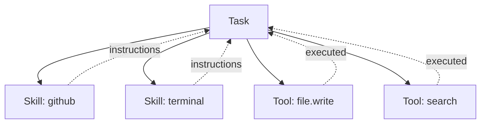

# Skills & Tools

**Skills** are instruction packages that teach agents how to approach specific tasks. **Tools** are the executable actions agents can take.

---

## Skills vs Tools

| | Skills | Tools |
|---|--------|-------|
| **Purpose** | Teach *how to think* about a domain | Provide *what to do* (actions) |
| **Content** | Instructions, best practices, workflows | Executable functions |
| **Format** | `SKILL.md` with YAML frontmatter | TypeScript modules with `CoreTool` interface |
| **Location** | `src/skills/<name>/` or `~/.openviber/skills/<name>/` | `src/tools/<name>.ts` |
| **Example** | "How to use GitHub CLI for issue workflows" | `gh_create_pr()`, `file.write()` |

Following the **Agent Skills spec** (agentskills.io), skills are instruction packages — they tell the agent WHAT to do and HOW using its existing tools. Skills are NOT tool containers themselves.

```mermaid
graph TB
    Agent[Agent] --> Skill[Skill: github]
    Agent --> Tool1[Tool: gh_create_pr]
    Agent --> Tool2[Tool: file.write]

    Skill -.instructions.-> Agent
    Tool1 -.executed by.-> Agent
    Tool2 -.executed by.-> Agent

    Style Skill fill:#e1f5fe,stroke:#0288d1
    Style Tool1 fill:#f3e5f5,stroke:#7b1fa2
    Style Tool2 fill:#f3e5f5,stroke:#7b1fa2
```

---

## Tools

Tools are the executable capabilities that give agents real-world actions. When an agent needs to "create a file" or "search the web", it uses tools.

### Built-in Tools

| Tool | What It Does |
|------|--------------|
| **File** | Read, write, create, and delete files |
| **Search** | Find information online |
| **Web** | Fetch, parse, and crawl web content |
| **Browser** | Navigate web pages, click, type, and extract content |
| **Desktop** | Interact with desktop applications |
| **Schedule** | Create, list, and manage recurring job schedules |
| **Notify** | Send desktop notifications for important events |
| **Shell** | Execute terminal commands |

### Skill-Provided Tools

Skills can have associated tools that are registered separately. The skill's `SKILL.md` teaches the agent how to use these tools effectively.

| Skill | Tools |
|-------|-------|
| **github** | `gh_list_issues`, `gh_get_issue`, `gh_clone_repo`, `gh_create_branch`, `gh_commit_and_push`, `gh_create_pr` |
| **cursor-agent** | `cursor_agent_run` |
| **codex-cli** | `codex_run` |
| **gemini-cli** | `gemini_run` |
| **terminal** | `terminal_check`, `terminal_new_session`, `terminal_run`, `terminal_read`, etc. |
| **railway** | `railway_up`, `railway_logs`, `railway_env_*` |
| **gmail** | `gmail_send`, `gmail_list`, `gmail_search` |
| **system-info** | `system_info_*` |

### Tool Registry

Tools are managed by the `ToolRegistry` in `src/tools/registry.ts`:

```typescript
// Tools are registered under namespaces
defaultToolRegistry.registerTools("github", getGithubTools());
defaultToolRegistry.registerTools("terminal", getTerminalTools());

// Get all tools for an agent
const tools = defaultToolRegistry.getToolsFor(["github", "terminal"]);
```

---

## Skills

Skills follow the **Agent Skills spec** with this structure:

```
skill-name/
├── SKILL.md       # Required — YAML frontmatter + markdown instructions
├── _meta.json     # Optional — registry metadata (owner, version, etc.)
├── scripts/       # Optional — executable scripts for the agent
└── references/    # Optional — reference documentation
```

### SKILL.md Format

Every skill has a `SKILL.md` file with YAML frontmatter:

```markdown
---
name: github
version: 1.0.0
description: GitHub operations via gh CLI — issues, branches, PRs
requires:
  binary:
    - name: gh
      check: gh --version
      install: brew install gh
  auth_cli:
    - name: GitHub auth
      check: gh auth status
      setup: gh auth login
---

# GitHub Skill

Interact with GitHub repositories using the `gh` CLI.

## Tools

- **gh_list_issues** — List open issues
- **gh_create_branch** — Create a new branch
- **gh_create_pr** — Create a pull request

## Workflow

1. `gh_list_issues` → pick an issue
2. `gh_clone_repo` → clone to workspace
3. `gh_create_branch` → create fix branch
4. Fix the issue (use codex-cli skill)
5. `gh_commit_and_push` → commit and push
6. `gh_create_pr` → create PR
```

### Frontmatter Fields

| Field | Type | Description |
|-------|------|-------------|
| `name` | Required | Skill identifier (used in task config) |
| `description` | Required | Short description of the skill |
| `version` | Optional | Semantic version |
| `requires` | Optional | Skill prerequisites (binaries, auth, env vars) |
| `playground` | Optional | Verification scenario for testing |
| `license` | Optional | License identifier |
| `allowedTools` | Optional | List of tools this skill can use |

### Skill Registry

The `SkillRegistry` (`src/skills/registry.ts`) discovers and loads skills:

1. Scans directories for `SKILL.md` files
2. Parses YAML frontmatter for metadata
3. Loads full instructions on demand
4. Checks for optional `scripts/` and `references/` directories

**Discovery order:**
1. `~/.openviber/skills/` — User custom skills
2. `src/skills/` — Bundled skills (dev mode)
3. Bundled skills in production build

---

## Skill Health Checks

OpenViber can verify that a skill's prerequisites are satisfied:

```typescript
interface SkillHealthCheck {
  id: string;
  label: string;
  ok: boolean;
  message?: string;
  hint?: string;
  actionType?: "env" | "oauth" | "binary" | "auth_cli" | "manual";
}
```

Each skill can define health checks for:
- **Binary dependencies** — CLI tools installed in PATH
- **Environment variables** — API keys or configuration
- **OAuth tokens** — Connected accounts
- **CLI auth** — Logged-in CLIs like `gh` or `codex`

The Viber Board shows health badges indicating whether a skill is ready to use.

---

## Built-in Skills

### github

**Purpose:** GitHub operations via `gh` CLI

**Tools:** `gh_list_issues`, `gh_get_issue`, `gh_clone_repo`, `gh_create_branch`, `gh_commit_and_push`, `gh_create_pr`

**Prerequisites:** `gh` CLI installed and authenticated

**Use case:** Automated issue triage, bug fixing, PR workflows

### cursor-agent

**Purpose:** Run Cursor CLI for software engineering tasks

**Tools:** `cursor_agent_run`

**Prerequisites:** Cursor CLI, terminal skill (for TTY)

**Use case:** Delegate coding tasks to Cursor

### codex-cli

**Purpose:** Run OpenAI Codex CLI for autonomous coding

**Tools:** `codex_run`

**Prerequisites:** `codex` CLI installed and authenticated

**Use case:** Non-interactive coding with structured output

### terminal

**Purpose:** Persistent terminal sessions for TTY-dependent CLIs

**Tools:** `terminal_new_session`, `terminal_run`, `terminal_read`, `terminal_send_keys`, etc.

**Prerequisites:** `tmux` installed

**Use case:** Multi-terminal layouts, monitoring long-running processes

### railway

**Purpose:** Railway deployment and management

**Tools:** `railway_up`, `railway_logs`, `railway_env_*`

**Prerequisites:** `railway` CLI installed and authenticated

**Use case:** Deploy and manage Railway projects

### gmail

**Purpose:** Send and search Gmail messages

**Tools:** `gmail_send`, `gmail_list`, `gmail_search`

**Prerequisites:** Google OAuth connected (`viber auth google` or `GOOGLE_CLIENT_ID`)

**Use case:** Email notifications and searches

### gemini-cli

**Purpose:** Run Google Gemini CLI

**Tools:** `gemini_run`

**Prerequisites:** `gemini` CLI installed, authenticated

**Use case:** Google Gemini model access from CLI

### system-info

**Purpose:** Get system information

**Tools:** `system_info_*`

**Prerequisites:** None (uses Node.js built-ins)

**Use case:** Query OS, CPU, memory, disk info

---

## Skill Hub

The **Skill Hub** is a marketplace for discovering and importing skills from external sources:

**Supported sources:**
- **OpenClaw** — The central Agent Skills registry
- **npm** — Scoped packages like `@openviber-skills/web-search`
- **GitHub** — Import directly from repositories
- **Hugging Face** — ML and AI skills
- **Smithery** — Agent tool registry
- **Composio** — Tool integrations
- **Glama** — AI model skills

### Importing Skills

```bash
# Auto-detect source
openviber skill add github

# Specify source
openviber skill add npm:@openviber-skills/web-search
openviber skill add openclaw:web-search

# From GitHub
openviber skill add dustland/viber-skills/github
```

Imported skills are installed to `~/.openviber/skills/` and become available to all tasks.

---

## Using Skills in Tasks

### Via Viber Board

1. Go to a Viber's configuration
2. Select "Skills"
3. Toggle skills on/off
4. Health indicators show readiness

### Via Configuration

```yaml
# ~/.openviber/vibers/dev.yaml
skills:
  - github
  - cursor-agent
  - terminal
```

### In Jobs

```yaml
# ~/.openviber/jobs/daily-summary.yaml
name: Daily Summary
schedule: "0 9 * * *"
model: deepseek/deepseek-chat
skills:
  - github
prompt: Summarize my GitHub issues from the last 24 hours.
```

---

## Creating Custom Skills

1. Create a directory in `~/.openviber/skills/`:
   ```bash
   mkdir -p ~/.openviber/skills/my-skill
   ```

2. Create `SKILL.md`:
   ```markdown
   ---
   name: my-skill
   description: What this skill teaches the agent
   version: 1.0.0
   ---

   # My Skill

   You are an expert on [domain]. Your responsibilities are:
   ...

   ## When to use

   - Situation 1
   - Situation 2

   ## Tools

   - **tool1** — What it does
   - **tool2** — What it does
   ```

3. Optionally add:
   - `scripts/` — Executable scripts the agent can run
   - `references/` — Documentation files
   - `_meta.json` — Registry metadata

Custom skills are auto-discovered and available immediately.

---

## Putting It Together



- **Task** uses **Skills** for domain knowledge
- **Task** uses **Tools** for actions
- **Skills** teach the task HOW to use tools effectively
- **Tools** provide the actual capabilities

---

## Next Steps

- [Jobs](/docs/concepts/jobs) — Schedule recurring tasks that use skills
- [Viber](/docs/concepts/viber) — How to configure tasks with skills
- [Tasks](/docs/concepts/tasks) — The unit of work in OpenViber
- [Security](/docs/design/security) — Tool permissions and safety
