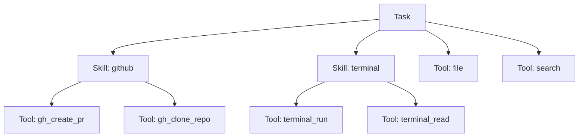

# Skills & Tools

**Skills** are bundles of domain knowledge that teach agents how to approach specific tasks. **Tools** are the actions agents can take to accomplish those tasks.

---

## Skills vs Tools

| | Skills | Tools |
|---|--------|-------|
| **Purpose** | Teach *how to think* about a domain | Provide *what to do* (actions) |
| **Content** | Instructions, best practices, workflows | Executable functions |
| **Format** | Markdown (`SKILL.md`) + optional code (`index.ts`) | TypeScript classes or functions |
| **Example** | "How to use the Cursor CLI from automation" | `file.write()`, `search()` |
| **Loaded when** | Referenced in task config | Registered in the tool registry or bundled with a skill |

A skill can *include* tools, but a tool never includes a skill. Skills are the higher-level concept — they provide the knowledge and context, while tools provide the actions.

**Think of it this way:**
- A **skill** is like training documentation — it teaches the agent *how* to approach a problem
- A **tool** is like a power tool — it lets the agent *do* something

---

## Tools

Tools are the bridge between AI reasoning and real-world actions. When you ask an agent to "create a file", it uses a **file tool**. When you ask it to "search the web", it uses a **search tool**.

Think of tools like apps on your phone — each one does something specific, and together they let you accomplish many different tasks.

### Built-in Tools

OpenViber comes with several core tools ready to use:

| Tool | What It Does |
|------|--------------|
| **File** | Read, write, create, and delete files |
| **Search** | Find information online |
| **Web** | Fetch, parse, and crawl web content |
| **Browser** | Navigate web pages, click, type, and extract content |
| **Desktop** | Interact with desktop applications |
| **Schedule** | Create, list, and manage recurring job schedules |
| **Notify** | Send desktop notifications for important events |

### How Agents Use Tools

When an agent decides to use a tool:

1. It selects the appropriate tool for the task
2. Provides the necessary inputs (like a filename or search query)
3. Executes the action
4. Receives the result and continues reasoning

You can observe this process in real-time through the Viber Board.

### Tool Permissions

For safety, tools can be restricted:

- **Allowed tools** — Only these tools can be used
- **Blocked tools** — These tools are never used
- **Approval required** — Agent asks before using these tools

This lets you control the blast radius of agent actions.

### Creating Custom Tools

You can create custom tools by writing a skill with an `index.ts` that exports a `getTools()` function. This keeps tools bundled with their domain context and makes them easy to share.

```typescript
import { z } from "zod";

export function getTools() {
  return {
    my_custom_action: {
      description: "Description of what this tool does",
      inputSchema: z.object({
        param: z.string().describe("Parameter description"),
      }),
      execute: async (args: { param: string }) => {
        // Tool implementation
        return { ok: true, result: "..." };
      },
    },
  };
}
```

Tools exported this way are automatically registered when the skill is loaded. They follow the same `CoreTool` interface as all OpenViber tools (Zod schema + execute function).

---

## Skills

Skills are bundles of domain knowledge that teach agents how to approach specific tasks. Unlike tools (which provide actions), skills provide *knowledge*, *context*, and optionally *specialized tools* scoped to a domain.

### How Skills Work

Each skill is a directory containing a `SKILL.md` file. When a skill is assigned to a task, the instructions from `SKILL.md` are injected into the agent's system prompt. This teaches the agent:

- **What to look for** — Patterns, signals, error indicators
- **How to approach problems** — Strategies, procedures, best practices
- **When to escalate** — Edge cases, risky situations, failure modes
- **Domain vocabulary** — Specific terms and concepts
- **Which tools to use** — Specialized tools bundled with the skill

### Skill Structure

A skill lives in a directory under `src/skills/` (built-in) or `~/.openviber/skills/` (user-defined):

```
src/skills/
└── my-skill/
    ├── SKILL.md       # Required — frontmatter metadata + instructions
    └── index.ts       # Optional — specialized tools for this skill
```

### SKILL.md Format

The `SKILL.md` file uses YAML frontmatter for metadata followed by Markdown instructions:

```markdown
---
name: my-skill
version: 1.0.0
description: Short description of what this skill does
author: Your Name
---

# My Skill

Instructions that get injected into the agent's context.

## When to Use

- Describe situations where this skill applies

## Procedures

1. Step-by-step procedures the agent should follow
2. Include error handling and edge cases
```

The frontmatter fields:

| Field | Required | Description |
|-------|----------|-------------|
| `name` | Yes | Skill identifier (used in task config) |
| `description` | Yes | Short description of the skill's purpose |
| `version` | No | Semantic version for the skill |
| `author` | No | Skill author |

### index.ts (Optional Tools)

If a skill provides specialized tools, they are exported from `index.ts`:

```typescript
import { z } from "zod";

export function getTools() {
  return {
    my_skill_action: {
      description: "Description of what this tool does",
      inputSchema: z.object({
        param: z.string().describe("Parameter description"),
      }),
      execute: async (args: { param: string }) => {
        // Tool implementation
        return { ok: true, result: "..." };
      },
    },
  };
}
```

### Skill Playgrounds (Verification)

Skills can optionally define a **playground** scenario for quick verification. The `skill-playground` skill exposes `skill_playground_verify` to run these checks.

Add a playground block to your `SKILL.md` frontmatter:

```yaml
playground:
  repo: dustland/openviber
  file: src/skills/cursor-agent/index.ts
```

Run it from the CLI:

```
openviber skill verify cursor-agent
```

Or call the tool directly:

```
skill_playground_verify({ skillId: "cursor-agent" })
```

### Skill Registry

The `SkillRegistry` class manages skill discovery and loading:

1. **Discovery** — Scans the skills directory for subdirectories containing `SKILL.md`
2. **Loading** — Parses frontmatter metadata and instruction content
3. **Tool registration** — Loads and caches tools from `index.ts` via `getTools()`
4. **Lookup** — Provides `getSkill(id)` and `getAllSkills()` for runtime access

#### Discovery Order

Skills are discovered from multiple paths, in priority order:

1. **User skills** — `~/.openviber/skills/` (custom skills you create)
2. **Bundled skills** — Relative to the installed package (production)
3. **Development skills** — `src/skills/` in the working directory (dev mode)

#### Pre-registration

In bundled builds where dynamic import of `.ts` files isn't possible, skills pre-register their tools at startup via `preRegisterTools()`. The application entry point must call `registerDefaultSkills()` from `src/skills/index.ts` to ensure these tools are available.

---

## Built-in Skills

OpenViber ships with several built-in skills that include both domain knowledge and specialized tools:

### antigravity

**Purpose:** Monitor and auto-heal the Antigravity IDE application.

| | |
|---|---|
| **Tools** | `antigravity_check_and_heal` |
| **Use case** | Detect "Agent terminated" errors and click Retry automatically |
| **Depends on** | Browser CDP (Chrome DevTools Protocol) on port 9333 |

The `antigravity_check_and_heal` tool is an all-in-one health check. It scans all open browser pages for the Antigravity iframe, detects error dialogs, and clicks the Retry button if found. Returns status: `HEALTHY`, `RECOVERED`, `RECOVERY_FAILED`, `ERROR_NO_RETRY`, or `NO_BROWSER`.

### cursor-agent

**Purpose:** Run the Cursor CLI (`agent`) for software engineering tasks via terminal-backed automation.

| | |
|---|---|
| **Tools** | `cursor_agent_run` |
| **Use case** | Delegate coding tasks to Cursor CLI from a task |
| **Depends on** | Cursor CLI installed, terminal skill available |

**Critical:** The Cursor CLI requires a real TTY. Running it directly from a subprocess will hang. This skill runs the agent inside a persistent terminal session to provide a pseudo-terminal. The `cursor_agent_run` tool handles session creation, command execution, workspace trust acceptance, and output capture.

**Parameters:**
- `goal` — The coding task to send to Cursor
- `cwd` — Working directory (optional, defaults to process cwd)
- `waitSeconds` — How long to wait before capturing output (default: 45s)

### codex-cli

**Purpose:** Run OpenAI Codex CLI for autonomous coding tasks via non-interactive `codex exec`.

| | |
|---|---|
| **Tools** | `codex_run` |
| **Use case** | Delegate coding tasks to Codex CLI from a task |
| **Depends on** | Codex CLI installed (`pnpm add -g @openai/codex`), authenticated |

Unlike cursor-agent, codex-cli uses the non-interactive `codex exec` command, which works reliably from Node.js tool calls without a persistent terminal session. The tool returns structured, chat-friendly results:

- `summary` — Status, cwd, mode, exit code (compact one-liner)
- `stdoutTail` / `stderrTail` — Last ~80 lines of output
- `output` — Truncated combined output (max 12,000 chars)

**Parameters:**
- `prompt` — The coding task (required)
- `cwd` — Working directory (optional)
- `waitSeconds` — Timeout in seconds (default: 90, min: 10)
- `approvalMode` — `full-auto` (default), `auto-edit`, or `suggest` (read-only)
- `model` — Override the Codex model (e.g., `gpt-5-codex`)

### github

**Purpose:** GitHub operations via the `gh` CLI — issues, branches, PRs, cloning.

| | |
|---|---|
| **Tools** | `gh_list_issues`, `gh_get_issue`, `gh_clone_repo`, `gh_create_branch`, `gh_commit_and_push`, `gh_create_pr` |
| **Use case** | Automated issue triage, bug fixing, PR workflows |
| **Depends on** | `gh` CLI installed and authenticated |

The github skill provides a complete workflow chain for autonomous issue fixing:

1. `gh_list_issues` → Find issues to work on
2. `gh_clone_repo` → Clone into `~/openviber_spaces/owner/repo`
3. `gh_create_branch` → Create a fix branch
4. *(Use codex-cli or cursor-agent to fix the issue)*
5. `gh_commit_and_push` → Commit and push the fix
6. `gh_create_pr` → Create a PR referencing the issue

### terminal

**Purpose:** Persistent terminal sessions for TTY-dependent CLIs, multi-terminal workspaces, and process monitoring.

| | |
|---|---|
| **Tools** | `terminal_check`, `terminal_prepare_skill_prerequisites`, `terminal_new_session`, `terminal_kill_session`, `terminal_rename_session`, `terminal_new_window`, `terminal_kill_window`, `terminal_rename_window`, `terminal_split_pane`, `terminal_send_keys`, `terminal_read`, `terminal_list`, `terminal_run` |
| **Use case** | Multi-terminal layouts, running CLIs that need a PTY, monitoring long-running processes |
| **Depends on** | tmux installed on the system (implementation detail) |

The terminal skill supports three modes:

- **Single command** — Use `terminal_run` to run a command and capture output
- **Multi-terminal layout** — Use `terminal_new_session`, `terminal_new_window`, `terminal_split_pane`, `terminal_send_keys`, and `terminal_list` to build complex terminal layouts (e.g., 3 Cursor agents + 2 dev servers)
- **Process monitoring** — Use `terminal_read` to read pane content without sending commands, ideal for monitoring builds, dev servers, or AI agents

Full session lifecycle: create → populate → operate → reorganize → clean up, with `terminal_kill_session`/`terminal_kill_window` for cleanup and `terminal_rename_session`/`terminal_rename_window` for reorganization.

**Target format:** `session` → `session:window` → `session:window.pane`

### skill-playground

**Purpose:** Verify skills end-to-end using predefined playground scenarios.

| | |
|---|---|
| **Tools** | `skill_playground_verify` |
| **Use case** | Smoke-test skills (e.g., cursor-agent) with a known repo/file |
| **Depends on** | Git installed; skill-specific dependencies |

The skill-playground tool reads the target skill's playground definition from `SKILL.md` and runs a safe, read-only verification flow.

---

## Using Skills

### Assigning Skills to a Task

Add skills to your task configuration in `~/.openviber/vibers/{id}.yaml`:

```yaml
name: "Developer"
model: "anthropic/claude-sonnet-4-20250514"
skills:
  - cursor-agent
  - codex-cli
  - github
  - terminal
```

### Skills in Jobs

Skills can also be assigned to scheduled jobs:

```yaml
name: "Health Check"
schedule: "*/3 * * * * *"
model: "deepseek/deepseek-chat"
skills:
  - antigravity
prompt: "Check Antigravity IDE health and auto-recover if needed."
```

### The Power of Skills

**Without skill:**
> "Check the Antigravity IDE for agent terminated errors. If you find one, look for the retry button and click it. Then wait and verify..."

**With skill:**
> "Monitor Antigravity and auto-recover if needed."

The skill contains all the detailed knowledge. The task knows what to look for, how to recover, and what tools to call.

---

## Creating Custom Skills

1. Create a directory under `~/.openviber/skills/`:
   ```bash
   mkdir -p ~/.openviber/skills/my-skill
   ```

2. Write `SKILL.md` with frontmatter and instructions:
   ```markdown
   ---
   name: my-skill
   description: What this skill teaches the agent
   ---

   # My Skill

   You are an expert on [domain]. Your responsibilities are:
   ...
   ```

3. Optionally add `index.ts` with specialized tools.

4. Reference the skill in your task config:
   ```yaml
   skills:
     - my-skill
   ```

Custom skills are discovered automatically on startup. No code changes to OpenViber are needed.

---

## Putting It Together

The relationship between skills, tools, and tasks:



- A **Task** uses multiple **Skills** and **Tools**
- A **Skill** can provide **Tools**
- **Tools** are the actual actions the agent takes

---

## Next Steps

- [Jobs](/docs/concepts/jobs) — Schedule recurring tasks that use skills
- [Viber](/docs/concepts/viber) — How to configure tasks with skills
- [Tasks](/docs/concepts/tasks) — The unit of work in OpenViber
- [Security](/docs/design/security) — Tool permissions and safety
