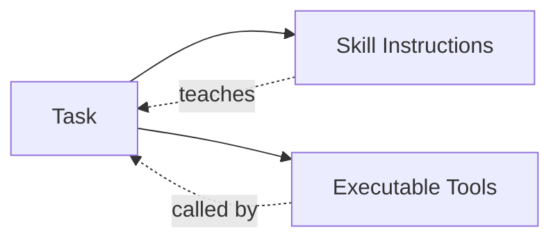

# Skills & Tools

**Skills** teach agents *how* to approach specific tasks. **Tools** are the actions agents can take.

---

## What are Skills?

A **Skill** is a knowledge package — a `SKILL.md` file that gives the agent instructions, workflows, and best practices for a domain.

Skills answer questions like:
- What should I look for?
- How do I approach this type of problem?
- What tools do I use, and when?
- What are the common pitfalls?

Skills are **instruction only** — they contain no executable code.

## What are Tools?

A **Tool** is an executable action — a function the agent can call to do something real.

Tools include:
- `file.write` — Create or modify a file
- `shell.run` — Execute a terminal command
- `gh_create_pr` — Create a GitHub pull request
- `web.fetch` — Fetch a web page

Tools are **independent** — any task can use any tool, with or without a skill.

---

## How They Work Together



1. The **Task** receives a goal from you
2. The **Skill** provides domain knowledge and context
3. The **Task** decides which **Tools** to use based on the skill's guidance

**Example:** To fix a GitHub issue, the task uses the `github` skill, which teaches it to chain `gh_list_issues` → `gh_clone_repo` → `gh_create_branch` → `gh_create_pr`.

---

## Built-in Skills

| Skill | What It Teaches |
|-------|-----------------|
| **github** | How to automate GitHub workflows (issues, PRs, branches) |
| **cursor-agent** | How to use the Cursor CLI for coding tasks |
| **codex-cli** | How to use OpenAI Codex for autonomous coding |
| **terminal** | How to manage persistent terminal sessions for TTY-dependent CLIs |
| **railway** | How to deploy and manage Railway projects |
| **gmail** | How to send and search Gmail messages |

---

## Built-in Tools

| Tool | What It Does |
|------|--------------|
| `file.*` | Read, write, create, delete files |
| `shell.run` | Execute one-off terminal commands |
| `terminal.*` | Persistent tmux sessions for interactive CLIs |
| `web.*` | Fetch and parse web content |
| `search` | Find information online |
| `gh_*` | GitHub operations (issues, clones, branches, PRs) |
| `cursor_agent_run` | Run Cursor CLI for coding |
| `codex_run` | Run OpenAI Codex for coding |
| `railway_*` | Railway deployment and management |
| `gmail_*` | Send and search Gmail |
| `notify` | Send desktop notifications |

**Shell vs Terminal:**
- `shell.run` — Quick commands, run once and get output
- `terminal.*` — Interactive CLIs (Cursor, Codex), long-running processes, monitoring

---

## Skill Structure

Following the **Agent Skills spec**, every skill is a directory with a `SKILL.md` file:

```
skill-name/
├── SKILL.md       # Instructions (YAML frontmatter + markdown)
├── _meta.json     # Optional metadata (version, owner, etc.)
├── scripts/       # Optional scripts the agent can run
└── references/    # Optional reference docs
```

**SKILL.md format:**

```markdown
---
name: github
description: GitHub operations via gh CLI
---

# GitHub Skill

You work with GitHub using the `gh` CLI.

## When to use

- Checking issues to fix
- Creating branches and PRs
- Any GitHub automation

## Tools

- `gh_list_issues` — List open issues
- `gh_create_branch` — Create a branch
- `gh_create_pr` — Create a pull request

## Workflow

1. `gh_list_issues` → pick an issue
2. `gh_clone_repo` → clone to workspace
3. `gh_create_branch` → create fix branch
4. Fix the issue (use codex-cli)
5. `gh_commit_and_push` → commit and push
6. `gh_create_pr` → create PR
```

---

## Using Skills

Skills are assigned to tasks via configuration:

```yaml
# ~/.openviber/vibers/dev.yaml
skills:
  - github
  - codex-cli
  - terminal
```

Or through the Viber Board UI — toggle skills on/off per task.

---

## Skill Health Checks

Some skills require external dependencies (CLI tools, API keys, OAuth tokens). OpenViber can verify these prerequisites automatically.

### Health Indicators

In the Viber Board, each skill shows a health badge:

| Badge | Meaning |
|-------|---------|
| ✓ **Ready** | All prerequisites satisfied |
| ⚠ **Setup Needed** | Missing dependencies (binary, auth, env var) |

### What Gets Checked

| Check Type | Example |
|------------|---------|
| **Binary** | Is `gh` CLI installed? Is `tmux` available? |
| **CLI Auth** | Is `gh auth login` complete? Is `codex` authenticated? |
| **OAuth** | Is Google account connected? |
| **Env Var** | Is `OPENAI_API_KEY` set? |

### Fixing Health Issues

Click on a skill with a setup warning to see:
- What's missing
- The fix (install command, auth flow, or env var to set)
- One-click fixes where possible

### Example

```bash
# Check health via CLI
openviber status

# Output:
# Skill Health
# ────────────────────────────────────
#   github                 MISSING
#     - gh-cli: Not found in PATH
#     - gh-auth: Not authenticated
# ────────────────────────────────────
```

---

## Installing Skills

The **Skill Hub** is a marketplace for discovering skills from external sources:

```bash
# Auto-detect source
openviber skill import github

# From npm
openviber skill import npm:@openviber-skills/web-search

# From GitHub
openviber skill import dustland/viber-skills/github
```

**Sources:** OpenClaw, npm, GitHub, Hugging Face, Smithery, Composio, Glama

---

## Creating Custom Skills

1. Create a directory:
   ```bash
   mkdir -p ~/.openviber/skills/my-skill
   ```

2. Create `SKILL.md`:
   ```markdown
   ---
   name: my-skill
   description: What this skill does
   ---

   # My Skill

   You are an expert on [domain].

   ## When to use

   - Situation 1
   - Situation 2

   ## Tools

   - **tool1** — What it's for
   - **tool2** — What it's for
   ```

3. The skill is auto-discovered and available immediately.

---

## Next Steps

- [Tasks](/docs/concepts/tasks) — The unit of work in OpenViber
- [Viber](/docs/concepts/viber) — How to configure tasks with skills
- [Jobs](/docs/concepts/jobs) — Schedule recurring tasks that use skills
