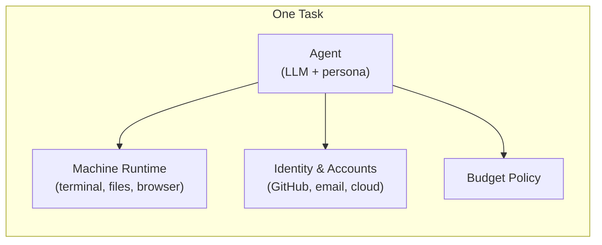
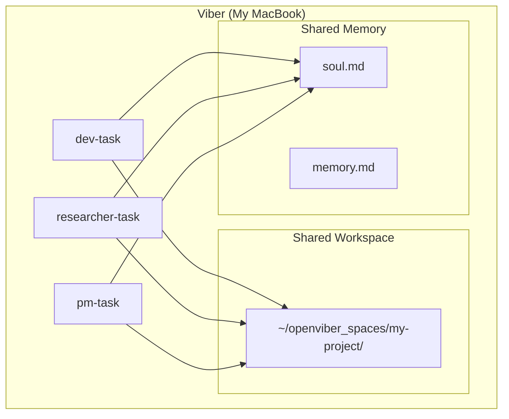
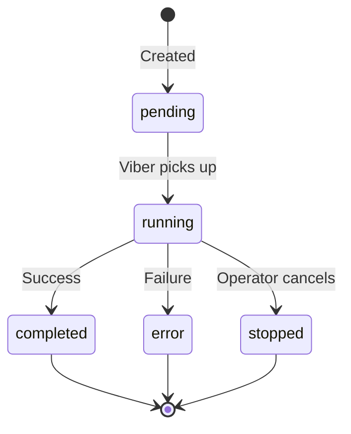

# Tasks

> **The unit of work in OpenViber.**

A **Task** is a specialized AI worker with a defined role, goals, and access to your machine's resources.

---

## What is a Task?

A task combines three elements:



| Element | What It Gives You |
|---------|-------------------|
| **Persona & Goals** | Role focus — a specialist with clear objectives, not a generic assistant |
| **Machine Runtime** | Real execution — terminal commands, file operations, browser automation |
| **Identity & Accounts** | Agency — acts on your behalf across GitHub, email, cloud services |

This is what separates tasks from chatbots: they don't just answer questions, they **do the work**.

---

## Task vs Viber

Understanding the distinction:

| | Viber | Task |
|---|-------|------|
| **What** | The machine running OpenViber | A unit of work with a specific role |
| **Scope** | Hosts multiple tasks | Single focused purpose |
| **Memory** | Shared `soul.md` and `memory.md` across all its tasks | Uses Viber's memory, adds session history |
| **Workspace** | Defines which spaces are accessible | Works within Viber's declared spaces |
| **Example** | "My MacBook" | "dev-task", "researcher-task", "pm-task" |

**Key relationship**: One Viber runs multiple tasks. All tasks on a Viber share the same workspace and memory.



Tasks in the same Viber can read and edit files created by each other — they belong to the same user and workflow.

---

## Task Lifecycle



| State | Meaning |
|-------|---------|
| `pending` | Task created, waiting for Viber to start |
| `running` | Viber is executing the task |
| `completed` | Task finished successfully |
| `error` | Task failed (provider error, tool error) |
| `stopped` | Operator explicitly stopped the task |

---

## Task Configuration

Each task is configured via YAML at `~/.openviber/vibers/{id}.yaml`:

```yaml
# ~/.openviber/vibers/dev-task.yaml
name: dev-task
model: anthropic/claude-3.5-sonnet

# Which spaces this task can work in
spaces:
  - ~/openviber_spaces/my-webapp
  - ~/code/legacy-api

# Which tools this task can use
tools:
  - file
  - shell
  - browser
  - github

# Working mode
mode: agent_decides  # always-ask | agent_decides | always-execute

# Budget limits
budget:
  maxCost: 5.00         # USD per task
  maxTokens: 100000     # Token limit
  timeout: 30           # Minutes
```

---

## Working Modes

| Mode | Description | When to Use |
|------|-------------|-------------|
| **Always Ask** | Task asks before each execution action | Building trust, learning |
| **Agent Decides** | Active execution within policy boundaries | Daily work, established workflows |
| **Always Execute** | High autonomy; intervene by exception | Overnight runs, trusted tasks |

The mode controls how much autonomy the task has. Start with "Always Ask" and graduate as you build confidence.

---

## Task Memory

Tasks have three types of memory:

| Type | Scope | Location | Purpose |
|------|-------|----------|---------|
| **soul.md** | Viber-level | `~/.openviber/vibers/{id}/soul.md` | Persona, communication style |
| **memory.md** | Viber-level | `~/.openviber/vibers/{id}/memory.md` | Long-term knowledge, key decisions |
| **Sessions** | Task-level | `~/.openviber/vibers/{id}/sessions/*.jsonl` | Conversation history |

All tasks on a Viber share `soul.md` and `memory.md`. This means:
- A decision made by `dev-task` is visible to `researcher-task`
- The persona is consistent across all tasks on the Viber
- Knowledge accumulates over time within the Viber

See [Memory](/docs/concepts/memory) for details.

---

## Multi-Task Coordination

When multiple tasks run on one Viber, they coordinate through **external systems**, not direct messaging:

```
researcher-task → writes report → GitHub issue (state:needs-triage)
pm-task         → triages issue → labels state:ready-for-dev
dev-task        → implements    → opens PR (Fixes #...)
comms-task      → announces     → GitHub release + email
```

This keeps each task **independent and stateless** — the handoff state machine lives in GitHub labels, not in OpenViber.

---

## What Tasks Can Do

Tasks use **tools** provided by **skills** to interact with your machine and external services:

| Tool Category | Examples |
|---------------|----------|
| **File System** | `file.read`, `file.write`, `file.list` |
| **Terminal** | `shell.execute` — run any CLI command |
| **Web** | `web.fetch`, `web.scrape`, `browser.automate` |
| **Git** | `git.commit`, `git.push`, `git.create_pr` |
| **Communication** | `email.send`, `slack.postMessage` |
| **Desktop** | `desktop.launch_app`, `desktop.click` |

See [Skills & Tools](/docs/concepts/skills) for the complete reference.

**Security**: All tool executions are logged. Sensitive tools require approval. Path traversal attacks are blocked by resolving paths relative to declared spaces.

---

## Creating Tasks

### Via Viber Board (Web UI)

1. Click **New Task**
2. Select a Viber
3. Choose an intent template or enter a custom goal
4. Review required skills and install if needed
5. Launch

### Via CLI

To run an ad-hoc task using a specific agent configuration:

```bash
# Run a task using the "dev-task" configuration
# (Loads config from ~/.openviber/vibers/dev-task.yaml)
viber run --agent dev-task "Refactor the authentication module"
```

To run a task using the default agent:

```bash
viber run "Check my GitHub notifications"
```

---

## Example Tasks

| Task | Role | Tools | Typical Work |
|------|------|-------|--------------|
| **dev-task** | Software engineer | shell, file, git, github | Features, bugfixes, refactoring |
| **researcher-task** | Research analyst | web, browser, file | Market research, competitive analysis |
| **pm-task** | Product manager | github, jira, email | Triage, planning, releases |
| **comms-task** | Communications | email, slack, browser | Announcements, newsletters |

---

## Next Steps

- [Viber](/docs/concepts/viber) — The machine that runs tasks
- [Skills & Tools](/docs/concepts/skills) — What tasks can do
- [Memory](/docs/concepts/memory) — How tasks remember context
