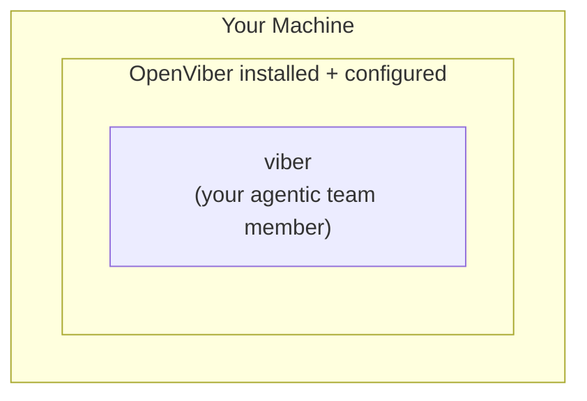

# Viber

> A **viber** is a machine transformed into your agentic team member.

When you install and configure OpenViber on a machine, that machine becomes a **viber** — a vivid, intelligent assistant you can talk to naturally. Think of it as adding a new team member who lives on that computer.

## The Mental Model



Instead of manually operating your computer, you **talk to viber**:

- "Research the latest AI trends and write a summary"
- "Set up a new project with TypeScript and React"
- "Review my code and suggest improvements"
- "Send the weekly report to the team"

## What Makes a Viber

A viber combines three elements:

| Element | Purpose |
|---------|---------|
| **ViberAgent** | The orchestrating AI that understands your requests |
| **Machine Runtime** | Terminal, browser, files, applications |
| **Identity & Accounts** | GitHub, email, cloud services — acts on your behalf |

## Talking to Viber

Communication happens through natural conversation:

```
You: "Build a landing page for our new product"

Viber: I'll create a landing page. Here's my plan:
1. Set up a new Next.js project
2. Design the hero section
3. Add feature highlights
4. Deploy to Vercel

Should I proceed?

You: "Yes, but use a dark theme"

Viber: Got it. Starting with dark theme...
```

Viber works autonomously but keeps you informed. You can:
- **Observe** what viber is doing (terminal, browser)
- **Intervene** at any point (pause, redirect, stop)
- **Approve** sensitive actions before they happen

## Working Modes

| Mode | Description |
|------|-------------|
| **Always Ask** | Viber asks before each action |
| **Agent Decides** | Viber acts within policy boundaries |
| **Always Execute** | High autonomy, intervene by exception |

## Security Considerations

Since viber acts on your behalf, security is paramount:

- Viber can access your accounts (email, GitHub, etc.)
- Sensitive actions require explicit approval
- All actions are logged for audit
- Budget limits prevent runaway costs

See [Security](/docs/design/security) for the full delegation model.

## Next Steps

- [Agents](/docs/concepts/agents) — How ViberAgent orchestrates work
- [Spaces](/docs/concepts/spaces) — Organizing workspaces
- [Tools](/docs/concepts/tools) — What viber can do
