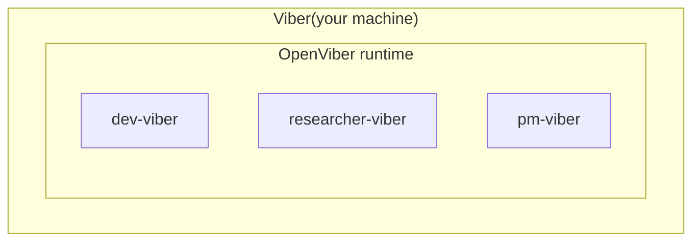

# Viber

> **You Imagine It. Vibers Build It.**

A **viber** is a role-scoped AI worker that runs on your machine. It has its own persona, goals, tools, and guardrails — think of it as a specialized teammate who works from your computer.

## How It Works



Your machine becomes a **Viber Node** — a runtime that hosts one or more vibers. Each viber has a distinct role. You talk to them naturally:

```
You:   "Build a landing page for our new product, dark theme"
Viber: I'll create a landing page. Here's my plan:
       1. Scaffold Next.js project
       2. Design hero + feature sections
       3. Deploy to Vercel
       Should I proceed?
You:   "Go ahead"
Viber: On it. You can watch in the terminal panel...
```

## Intent-Driven Creation (Viber Board)

In the web UI, the **New Task** flow is intent-first and environment-aware:

1. Pick an intent template (for example: _Build a Feature_, _Code Review_, _Railway Deploy Failures_)
2. OpenViber pre-fills the task goal from the template
3. OpenViber infers required skills from the intent
4. OpenViber compares required skills against the selected node's currently available skills
5. If a required skill is missing, the UI opens a guided prerequisite flow before launch
6. Once required skills are ready, the task auto-launches with the selected intent body

### How Required Skills Are Inferred

OpenViber merges skill requirements from three sources (highest confidence first):

1. `intent.skills` (explicit per-template list)
2. A `skills:` section declared inside the intent body
3. Keyword detection in the intent text (for skill-specific terms)

This gives good defaults for built-in templates while still letting you create precise custom templates.

### Guided Setup Before Launch

When a selected node is active but a required skill is not ready on that node, OpenViber starts a proactive setup flow:

- checks node availability
- runs skill provisioning for supported skills
- handles auth guidance when the skill needs external login
- retries launch automatically when prerequisites become available

If the node is offline, OpenViber asks you to bring it online before launching the task.

### Where to Manage Intents

You can manage built-in and custom intent templates in **Settings → Intents**:

- create and edit custom templates
- replicate built-in templates into editable user templates
- keep intent instructions aligned with your team workflows

## What Makes a Viber

A viber combines three elements that no chat-only AI has:

| Element                 | What It Gives You                                                            |
| ----------------------- | ---------------------------------------------------------------------------- |
| **Persona & Goals**     | Role focus — not a generic assistant, but a specialist with clear objectives |
| **Machine Runtime**     | Real execution — terminal, browser, files, apps on your machine              |
| **Identity & Accounts** | Agency — acts on your behalf across GitHub, email, cloud services            |

This is what separates vibers from chatbots: they don't just answer questions, they **do the work**.

## Working Modes

| Mode               | When to Use                                                    |
| ------------------ | -------------------------------------------------------------- |
| **Always Ask**     | Building trust — viber asks before each action                 |
| **Viber Decides**  | Daily work — viber acts within policy, escalates risky actions |
| **Always Execute** | Overnight runs — maximum autonomy, intervene by exception      |

Start with "Always Ask" and graduate to "Viber Decides" as you build confidence.

## You Stay in Control

Your viber works autonomously but you always have oversight:

- **Observe** — Watch terminal output in real time via tmux streaming
- **Intervene** — Pause, redirect, or stop at any point through chat
- **Approve** — Sensitive actions require explicit permission
- **Audit** — Every action is logged; budget limits prevent runaway costs

## Viber Node

A **Viber Node** is a single machine running the OpenViber runtime. It provides:

- **Scheduler** — Runs viber tasks on cron schedules (daily research, weekly reports)
- **Credentials** — Shared account access for all vibers on the node
- **Config** — Identity and viber settings at `~/.openviber/` (lightweight, portable)
- **Spaces** — Working data at `~/openviber_spaces/` (repos, research, outputs)

### Adding a Node

From the OpenViber Board, click **Add Node** to generate a one-liner:

```bash
npx openviber connect --token eyJub2RlIjoiYTFiMmMz...
```

This bootstraps the node, creates `~/.openviber/`, and connects to the Board — no inbound ports needed.

Multiple vibers coordinate through **external systems** (GitHub issues, email) rather than talking to each other directly. This keeps everything simple and stateless.

## Next Steps

- [Tools](/docs/concepts/tools) — What vibers can do
- [Skills](/docs/concepts/skills) — Domain knowledge bundles with specialized tools
- [Jobs](/docs/concepts/jobs) — Schedule recurring tasks for your vibers
- [Memory](/docs/concepts/memory) — How vibers remember context
