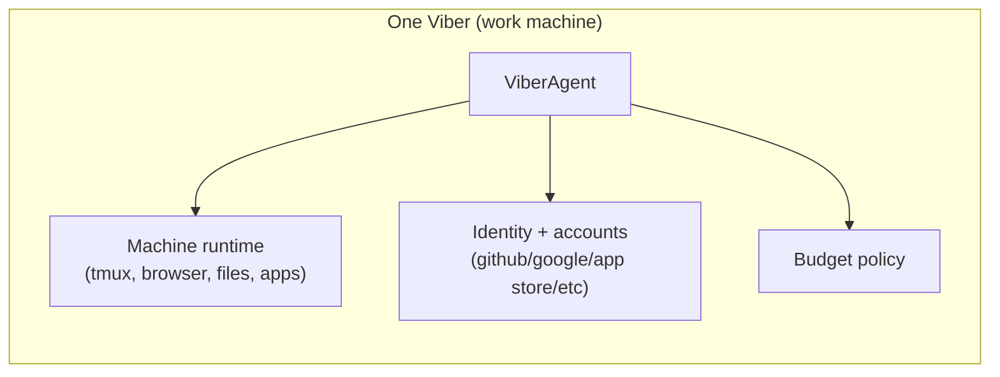
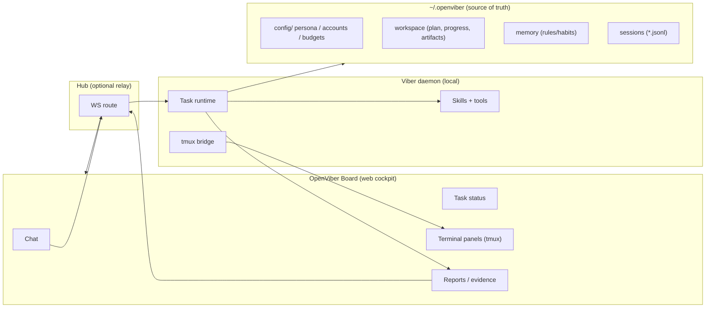

# Architecture

OpenViber is a workspace-first platform where each **viber** is a subordinate working unit on one machine.

## 1. The viber unit

A viber = `ViberAgent + work machine + configured user account context`.

The project is **OpenViber**; the deployed machine companion is still called a **viber**.

## 2. System topology

## 3. Storage ownership

- `~/.openviber/config` and agent files: identity, persona, account bindings, budget policies.
- `~/.openviber/workspace`: active plans, progress, and artifacts.
- `~/.openviber/memory`: work habits/rules and optional semantic indexes.
- `~/.openviber/agents/{id}/sessions/*.jsonl`: durable run/conversation logs.

The daemon remains process-stateless; durable context lives in files.

## 4. Working modes

OpenViber should expose familiar autonomy profiles:

- **Always Ask**: prompt-driven, asks before each execution action.
- **Agent Decides**: active execution with policy-based approval boundaries.
- **Always Execute**: high autonomy with intervention-by-exception.

All profiles share one loop: observe -> plan -> execute -> verify -> report -> request feedback -> continue.

## 5. Human control model

- Default intervention path is chat (pause/resume/reprioritize/re-scope).
- Full terminal observability comes from tmux streaming.
- GUI direct manipulation is out-of-band VNC/remote desktop, not direct Board window control.

## 6. Verification model

Acceptance must be evaluated from human-observable evidence:

- browser/app interactions,
- terminal output,
- screenshots/logs/URLs/commands,
- report with claims linked to proof.

No unverifiable self-grading.

## 7. Gateway control plane (critical for open-environment vibers)

OpenViber should treat a **single gateway** as the owner of the messaging/control plane per host. This is critical to keeping vibers stateless while still enabling rich multi-surface control.

- **Single Gateway per host**: one daemon is the authority for channel connections and agent runs on that machine.
- **WebSocket control plane**: all clients (Board, CLI, automation) connect over a typed WS protocol, and each connection declares **role + scopes** (operator vs node) at handshake time.
- **Device pairing + trust**: new device IDs require explicit pairing approval; local loopback/tailnet connects can be auto-approved to keep same-host UX smooth.
- **Challenge-based handshake**: gateway issues a nonce challenge; client signs it and sends device identity + auth token.
- **Idempotency keys** for side-effecting requests (send, run agent) to allow safe retries.
- **Events are push-only** (presence, agent progress, health, heartbeat). Clients must refresh state on gaps; events are not replayed.
- **Remote access pattern**: VPN/Tailscale or SSH tunnel to the gateway, reusing the same handshake + token.

This control plane keeps the daemon lean while allowing multiple operator surfaces and device nodes to coordinate safely.
