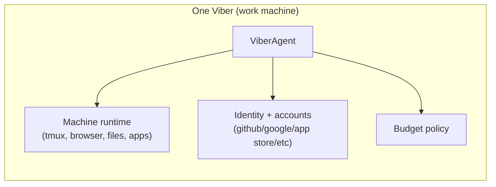
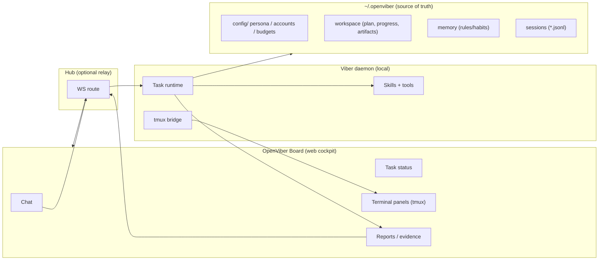

# Architecture

OpenViber is a workspace-first platform where each **viber** is a subordinate working unit on one machine.

## 1. The viber unit

A viber = `ViberAgent + work machine + configured user account context`.

The project is **OpenViber**; the deployed machine companion is still called a **viber**.

## 2. System topology

## 3. Storage ownership

- `~/.openviber/config` and agent files: identity, persona, account bindings, budget policies.
- `~/.openviber/workspace`: active plans, progress, and artifacts.
- `~/.openviber/memory`: work habits/rules and optional semantic indexes.
- `~/.openviber/agents/{id}/sessions/*.jsonl`: durable run/conversation logs.

The daemon remains process-stateless; durable context lives in files.

## 4. Working modes

- **Vision mode**: proactive, self-directed roadmap execution against a long-horizon mission.
- **Mandate mode**: concrete assignment execution with clear acceptance criteria.

Both modes share one loop: observe -> plan -> execute -> verify -> report -> request feedback -> continue.

## 5. Human control model

- Default intervention path is chat (pause/resume/reprioritize/re-scope).
- Full terminal observability comes from tmux streaming.
- GUI direct manipulation is out-of-band VNC/remote desktop, not direct Board window control.

## 6. Verification model

Acceptance must be evaluated from human-observable evidence:

- browser/app interactions,
- terminal output,
- screenshots/logs/URLs/commands,
- report with claims linked to proof.

No unverifiable self-grading.
