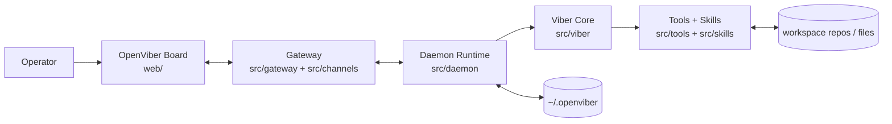

# OpenViber Architecture Overview

This page is a quick map of the system. For detailed behavior and contracts, follow the links in [Detailed design docs](#detailed-design-docs).

## Runtime topology

## Layer boundaries (summary)

- `web/`: UI only; communicates via API/WebSocket boundaries.
- `src/channels` and `src/gateway`: transport adapters and routing.
- `src/daemon`: orchestration, task lifecycle, and runtime coordination.
- `src/viber`: planning/execution behavior and agent-level loop.
- `src/tools` and `src/skills`: capability surfaces used by vibers.
- `~/.openviber`: durable runtime state and personalization.

## Detailed design docs

- `docs/design/viber.md`
- `docs/design/communication.md`
- `docs/design/protocol.md`
- `docs/design/task-lifecycle.md`
- `docs/design/context-management.md`
- `docs/design/memory.md`
- `docs/design/personalization.md`
- `docs/design/mcp-integration.md`
- `docs/design/streaming.md`
- `docs/design/error-handling.md`
- `docs/design/security.md`
- `docs/design/environments-and-tasks.md`
- `docs/design/polyglot-integration-contract.md`
