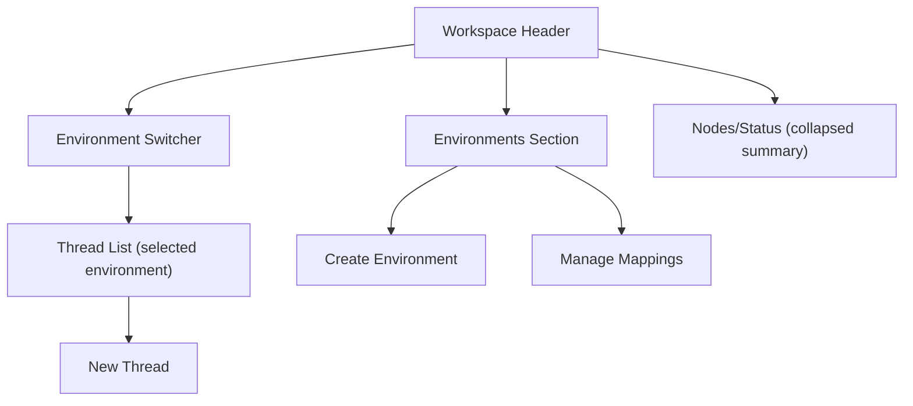

# Environments and Threads

This design defines how OpenViber should evolve from a node-first sidebar to an **environment-first** workflow similar to Codex:

- **Environment** = reusable execution context (repo, setup, vars, policies)
- **Thread** = one work stream/topic inside an environment
- **Node binding** = where that environment is provisioned and runnable

References:
- [Issue #62: Workspace and Environment Configuration](https://github.com/dustland/openviber/issues/62)
- [Codex cloud environments](https://developers.openai.com/codex/cloud/environments)
- [Codex local environments](https://developers.openai.com/codex/local-environments)

---

## 1. Goals

1. Make the sidebar reflect how users think: pick an environment, then manage threads.
2. Let users create/map environments from web UI without SSHing into machines for day-to-day setup.
3. Keep node onboarding secure and simple while enabling remote environment provisioning afterward.
4. Satisfy issue #62 requirements: environment model, setup scripts, secure vars, runtime injection.

Non-goals:
- Full replacement of node onboarding bootstrap in v1.
- Multi-cloud orchestration in first release.

---

## 2. Core Model

### 2.1 Concepts

- **Thread**: user-visible work unit (chat + execution timeline + artifacts), scoped to one environment.
- **Environment**: declarative runtime spec.
- **Environment Binding**: resolved mapping of an environment to a specific node and working directory.
- **Node**: machine running OpenViber daemon.

### 2.2 Mapping to current model

- Current `task` becomes an execution run within a thread.
- Current `space` becomes a compatibility alias for environment-backed workspace state.
- `viber_nodes` remains the machine registry.

---

## 3. Sidebar Redesign

### 3.1 Information architecture

### 3.2 Desktop layout

- Top:
  - Current environment name + status pill (`Unmapped`, `Preparing`, `Ready`, `Error`)
  - `New Thread` primary action
- Main section:
  - Search threads
  - Thread list grouped by `Today`, `Last 7 days`, `Archived`
  - Thread row: title, last activity, node badge, run state
- Secondary section:
  - Environments list (pin/favorite + quick switch)
  - `Create Environment`
- Footer:
  - Node health summary + user menu + docs/settings

### 3.3 Mobile behavior

- Environment switcher and `New Thread` remain top-priority.
- Threads panel first; environment management opens as sheet.

---

## 4. Environment Lifecycle UX

### 4.1 Create Environment

Create form mirrors Codex-style structure:

1. **Basic**
- Name, description
- Type (`github`, `local`, `manual`)
- Repo/org/branch or local path

2. **Code Execution**
- Container image (optional)
- Working directory
- Setup script (`auto` or `manual`)
- Network access toggle
- Persistent volume toggle

3. **Variables**
- Environment variables (plain)
- Secure variables (masked/secret)

4. **Validation**
- Dry-run validate script syntax
- Verify repo accessibility (for GitHub type)

### 4.2 Map to Node (no manual shell for normal ops)

User clicks `Map to Node`:
- Select target node
- Select strategy:
  - `Auto clone + setup` (default)
  - `Use existing path`
- Click `Prepare Environment`

System flow:
1. Board stores binding request.
2. Hub pushes `environment:prepare` to node.
3. Node daemon performs clone/pull, setup, and health check.
4. Board receives status events and updates UI.

---

## 5. Data Model

### 5.1 `environments`

Required fields from issue #62 plus execution metadata:

- `id`, `user_id`, `name`, `description`
- `type` (`github` | `local` | `manual`)
- `repo_url`, `repo_org`, `repo_name`, `repo_branch`
- `container_image`, `working_dir`, `setup_script`
- `network_access` (bool), `persist_volume` (bool)
- `metadata` (json)
- `created_at`, `updated_at`

### 5.2 `environment_vars`

- `id`, `environment_id`, `key`, `value`, `is_secret=false`

### 5.3 `environment_secrets`

- `id`, `environment_id`, `key`, `encrypted_value`, `kms_key_id`, `created_at`
- Never returned in plaintext from normal GET APIs.

### 5.4 `environment_bindings`

- `id`, `environment_id`, `node_id`
- `resolved_working_dir`
- `status` (`pending`, `preparing`, `ready`, `error`, `stale`)
- `last_prepare_at`, `last_error`

### 5.5 `threads`

- `id`, `user_id`, `environment_id`, `title`
- `active_node_id` (optional; defaults from ready binding)
- `status` (`active`, `paused`, `archived`)
- `last_message_at`, `created_at`, `updated_at`

---

## 6. API Surface

### 6.1 Web APIs

- `POST /api/environments`
- `GET /api/environments`
- `GET /api/environments/:id`
- `PUT /api/environments/:id`
- `DELETE /api/environments/:id`
- `POST /api/environments/:id/bindings` (node + strategy)
- `GET /api/environments/:id/bindings`
- `POST /api/threads`
- `GET /api/threads?environmentId=...`
- `POST /api/threads/:id/messages`

### 6.2 Node config pull

Keep `/api/nodes/[id]/config` but extend payload:

- `config.environments[]` summary
- `config.bindings[]` for this node
- `config.version` for cache invalidation

---

## 7. Hub/Daemon Protocol Additions

New control-plane messages:

- Board/Hub -> Node
  - `environment:prepare`
  - `environment:sync`
  - `thread:submit` (includes `threadId`, `environmentId`, `bindingId`)
- Node -> Board/Hub
  - `environment:status` (`preparing`, `ready`, `error`)
  - `environment:log` (setup logs, redacted)
  - `thread:started`, `thread:progress`, `thread:completed`, `thread:error`

Node runtime component:
- `EnvironmentManager.prepare(binding)`:
  1. Resolve binding + env config
  2. Materialize repo/path
  3. Inject vars/secrets to process env
  4. Run setup script (idempotent)
  5. Emit status + diagnostics

---

## 8. Security and Secret Handling

1. Secrets encrypted at rest and never echoed back raw.
2. Setup/runtime logs pass through redaction before persistence/streaming.
3. Secret exposure boundaries:
- Board: masked values only
- Hub: pass-through encrypted references when possible
- Node: plaintext only in-memory at execution time
4. Node auth uses existing `auth_token` + ownership checks.

---

## 9. “No Machine Commands” Strategy

Practical rule:
- **One-time bootstrap still required** to establish trust and install daemon.
- After onboarding, environment creation/mapping/thread start is remote and commandless from web UI.

### v1 (recommended)

- Keep current `openviber onboard --token ...` bootstrap.
- Add remote `environment:prepare` so users never run repo/setup commands manually again.

### v2 (optional)

- Add managed bootstrap connectors (`SSH`, `cloud-init`, `Tailscale`, agent installer links) for near-zero-touch first install.

---

## 10. Rollout Plan

### Phase 1: Schema + CRUD (issue #62 baseline)
- Add environment tables and APIs.
- Add create/edit UI with secure var handling.

### Phase 2: Binding + Prepare
- Add mapping UI and `environment:prepare` protocol.
- Implement daemon `EnvironmentManager`.

### Phase 3: Sidebar migration
- Replace chat/ports/jobs-first sidebar with environment + thread-first IA.
- Keep jobs/ports as secondary tools per environment.

### Phase 4: Thread-native execution
- Route message sends via `threadId` + `environmentId`.
- Treat old task flow as compatibility mode.

---

## 11. Acceptance Criteria

1. User can create a GitHub-backed environment with setup script and secure vars from UI.
2. User can map environment to an active node and see live prepare status.
3. User can start a new thread inside that environment with no machine-side manual repo/setup commands.
4. Runtime receives env config; setup script runs before first thread task.
5. Secrets are masked in UI/logs and redacted in streamed output.
6. Sidebar defaults to environment + thread navigation.

---

## 12. Implementation Touchpoints

Likely files/services to update:

- `web/src/routes/vibers/[id]/+layout.svelte` (sidebar IA)
- `web/src/routes/vibers/+page.svelte` (environment/node creation entry points)
- `web/src/lib/server/viber-nodes.ts` (node-bound environment metadata)
- `web/src/routes/api/nodes/[id]/config/+server.ts` (config pull expansion)
- `src/daemon/controller.ts` (new control-plane message handlers)
- `src/daemon/runtime.ts` (environment-aware task bootstrap)
- `src/daemon/hub.ts` (relay and status fanout for environment events)
