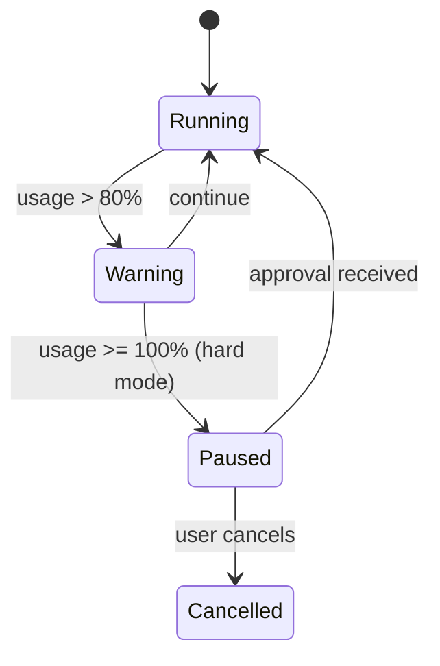

# Error Handling & Recovery

OpenViber operates in open environments where failures are expected. This document defines how the system handles errors at each layer while maintaining the stateless Viber principle.

## 1. Failure Categories

| Category | Examples | Recovery Owner |
|----------|----------|----------------|
| **Provider Failures** | LLM timeout, rate limit, API error | Viber (retry) |
| **Tool Failures** | Command timeout, permission denied, network error | Viber (report) |
| **Protocol Failures** | WebSocket disconnect, malformed message | Transport layer |
| **Configuration Errors** | Invalid task YAML, missing credentials | Startup validation |
| **Resource Exhaustion** | Budget exceeded, context overflow | Policy enforcement |

## 2. LLM Provider Error Handling

### Retry Policy

```yaml
# Default retry configuration
retry:
  max_attempts: 3
  base_delay_ms: 1000
  max_delay_ms: 30000
  backoff: exponential  # linear | exponential | jittered
  retryable_errors:
    - rate_limit
    - timeout
    - server_error    # 5xx
    - connection_error
```

### Provider-Specific Behavior

| Provider | Rate Limit | Retry-After | Fallback |
|----------|------------|-------------|----------|
| OpenAI | 429 | Header or 60s | Wait, then retry |
| Anthropic | 429 | Header or 60s | Wait, then retry |
| Local (Ollama) | N/A | N/A | Immediate retry |

### Non-Retryable Errors

These errors should fail immediately and report to the Viber Board:

- `401 Unauthorized` — Invalid API key
- `400 Bad Request` — Malformed request (likely a bug)
- `context_length_exceeded` — Requires context compaction
- `content_policy_violation` — Requires human review

### Fallback Strategy

When primary model fails after retries:

1. **Report failure** to Viber Board with error details
2. **Optional fallback model** if configured:
   ```yaml
   model: anthropic/claude-3-5-sonnet
   fallback_model: openai/gpt-4o-mini  # Used on repeated failures
   ```
3. **No silent degradation** — Viber Board must acknowledge model switch

## 3. Tool Execution Errors

### Timeout Handling

```yaml
tools:
  default_timeout_ms: 30000
  per_tool:
    shell_command: 120000  # 2 minutes for shell
    web_scrape: 60000      # 1 minute for web
    browser_action: 45000  # 45s for browser
```

### Error Response Format

Tool errors are returned to the LLM as structured results (not thrown):

```typescript
// Tool execution wrapper
async function executeTool(tool: Tool, params: unknown): Promise<ToolResult> {
  try {
    const result = await withTimeout(tool.execute(params), tool.timeout);
    return { success: true, result };
  } catch (error) {
    return {
      success: false,
      error: {
        type: classifyError(error), // 'timeout' | 'permission' | 'not_found' | 'unknown'
        message: error.message,
        recoverable: isRecoverable(error),
        suggestion: getSuggestion(error),
      },
    };
  }
}
```

### Error Classification

| Type | Meaning | Action |
|------|---------|--------------|
| `timeout` | Execution exceeded limit | Retry with simpler params or report |
| `permission` | Access denied | Report to user, suggest approval |
| `not_found` | Resource missing | Verify path/URL and retry |
| `rate_limit` | External API throttled | Wait and retry |
| `validation` | Invalid parameters | Fix params and retry |
| `unknown` | Unexpected error | Report with full context |

## 4. WebSocket Connection Errors

### Reconnection Strategy

```
Initial connect failed
    ↓
Wait 1s → Retry
    ↓ (fail)
Wait 2s → Retry
    ↓ (fail)
Wait 4s → Retry
    ↓ (fail after 5 attempts)
Enter disconnected mode, notify user
```

### During Disconnection

- **In-flight requests**: Mark as failed, do not auto-retry (may cause duplicates)
- **Pending tool results**: Queue locally, deliver on reconnect
- **Heartbeat**: Resume immediately on reconnect to verify session

### Idempotency

All side-effecting requests must include an idempotency key:

```typescript
interface TaskSubmitRequest {
  idempotency_key: string;  // UUID, generated by Viber Board
  goal: string;
  messages: Message[];
  // ...
}
```

The Viber deduplicates requests with the same key within a 5-minute window.

## 5. Configuration Errors

### Startup Validation

The Viber validates configuration at startup and fails fast:

```typescript
// Startup sequence
async function start() {
  // 1. Validate config files
  const configErrors = await validateConfig();
  if (configErrors.length > 0) {
    console.error('Configuration errors:');
    configErrors.forEach(e => console.error(`  - ${e.path}: ${e.message}`));
    process.exit(1);
  }

  // 2. Verify provider connectivity (optional, with timeout)
  if (config.verify_providers) {
    await verifyProviders();
  }

  // 3. Start Viber
  await startViber();
}
```

### Required vs Optional Config

| Field | Required | Default | Validation |
|-------|----------|---------|------------|
| `model` | Yes | — | Must be valid provider/model format |
| `name` | Yes | — | Non-empty string |
| `skills` | No | `[]` | Each skill must exist in registry |
| `tools` | No | `[]` | Each tool must be registered |
| `temperature` | No | `0.7` | 0.0 - 2.0 |
| `max_tokens` | No | Model default | Positive integer |

## 6. Budget Exhaustion

### Enforcement Modes

```yaml
budget:
  mode: soft  # soft | hard
  limit_usd: 10.00
  warning_threshold: 0.8  # Warn at 80%
```

| Mode | Behavior |
|------|----------|
| `soft` | Warn at threshold, allow overage, report in status |
| `hard` | Pause execution at limit, require explicit approval to continue |

### Budget Exceeded Flow



## 7. Context Overflow

When context exceeds model limits:

1. **Detect early**: Estimate tokens before sending
2. **Auto-compact**: If enabled, summarize older messages
3. **Report**: If compaction insufficient, return error to Viber Board

```typescript
interface ContextOverflowError {
  type: 'context_overflow';
  current_tokens: number;
  max_tokens: number;
  suggestion: 'compact_history' | 'reduce_tools' | 'start_new_session';
}
```

## 8. Viber Crash Recovery

Since the Viber is stateless, recovery is straightforward:

1. **Restart Viber** — No state to restore
2. **Viber Board re-sends** — Current task context on next request
3. **In-flight work** — Lost; Viber Board should retry with same idempotency key

### Crash Detection

The Viber Board detects Viber unavailability via:

- WebSocket disconnect without clean close
- Heartbeat timeout (default: 30s)
- HTTP health check failure

### Session Logs

Optional session logs (`~/.openviber/vibers/{id}/sessions/*.jsonl`) provide forensic data but are **not used for recovery** — they're write-only audit trails.

## 9. Graceful Degradation

### Feature Flags

```yaml
degradation:
  disable_browser_on_error: true   # Fall back to web_scrape
  disable_screenshots_on_error: true
  reduce_parallelism_on_rate_limit: true
```

### Degradation Hierarchy

```
Full capability
    ↓ (browser fails)
Web scraping only
    ↓ (scraping fails)
Text-only mode (report limitation to user)
```

## 10. Error Reporting

### To Viber Board

All errors surfaced to the Viber Board include:

```typescript
interface ErrorReport {
  type: string;           // Error category
  message: string;        // Human-readable description
  recoverable: boolean;   // Can the operation be retried?
  context?: {
    tool?: string;        // Which tool failed
    provider?: string;    // Which LLM provider
    attempt?: number;     // Retry attempt number
  };
  suggestion?: string;    // Recommended action
  timestamp: string;      // ISO 8601
}
```

### Logging

Local logs follow structured format:

```jsonl
{"level":"error","ts":"2024-01-15T10:30:00Z","msg":"Tool execution failed","tool":"shell_command","error":"timeout","duration_ms":30000}
{"level":"warn","ts":"2024-01-15T10:30:01Z","msg":"Retrying LLM request","provider":"anthropic","attempt":2,"error":"rate_limit"}
```

---

## Summary

| Failure Type | Strategy | Owner |
|--------------|----------|-------|
| LLM transient | Retry with backoff | Viber |
| LLM permanent | Fail fast, report | Viber → Board |
| Tool error | Return structured error to LLM | Viber |
| Connection loss | Reconnect with backoff | Transport |
| Budget exceeded | Pause or warn based on mode | Policy layer |
| Context overflow | Compact or fail with suggestion | Viber → Board |
| Viber crash | Stateless restart, Board re-sends | Board |

The key principle: **errors are data, not exceptions**. The Viber reports errors clearly; the Viber Board decides how to proceed.
