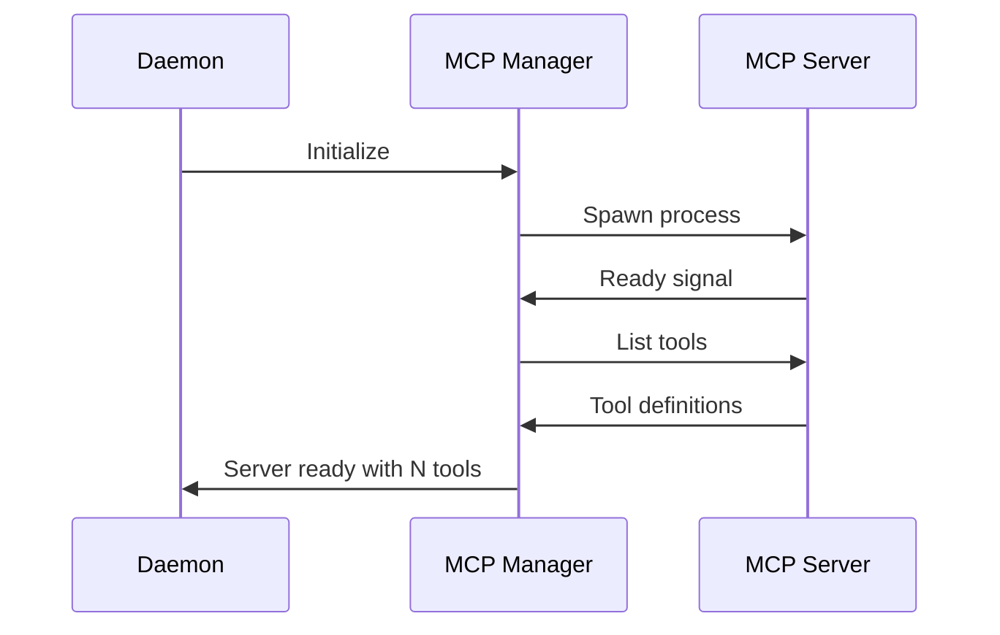

# MCP Integration

OpenViber integrates with [Model Context Protocol (MCP)](https://modelcontextprotocol.io) servers to extend agent capabilities with standardized tools and resources.

## 1. Overview

MCP provides a standard way for AI agents to interact with external systems. OpenViber acts as an MCP **client**, connecting to MCP **servers** that expose tools and resources.

```
┌─────────────────────────────────────────────────────────────┐
│                    OpenViber Daemon                          │
│                                                              │
│  ┌──────────┐    ┌──────────────────────────────────────┐   │
│  │  Agent   │───▶│         MCP Client Manager           │   │
│  └──────────┘    └──────────────────────────────────────┘   │
│                              │                               │
│         ┌────────────────────┼────────────────────┐         │
│         ▼                    ▼                    ▼         │
│  ┌────────────┐      ┌────────────┐      ┌────────────┐    │
│  │ MCP Server │      │ MCP Server │      │ MCP Server │    │
│  │  (GitHub)  │      │ (Postgres) │      │   (Slack)  │    │
│  └────────────┘      └────────────┘      └────────────┘    │
└─────────────────────────────────────────────────────────────┘
```

## 2. Configuration

### Basic Setup

```yaml
# ~/.openviber/config.yaml

mcp_servers:
  - name: "github"
    command: "npx"
    args: ["-y", "@modelcontextprotocol/server-github"]
    env:
      GITHUB_TOKEN: "${GITHUB_TOKEN}"

  - name: "filesystem"
    command: "npx"
    args: ["-y", "@modelcontextprotocol/server-filesystem", "/home/user/projects"]

  - name: "postgres"
    command: "npx"
    args: ["-y", "@modelcontextprotocol/server-postgres"]
    env:
      DATABASE_URL: "${DATABASE_URL}"
```

### Full Configuration Options

```yaml
mcp_servers:
  - name: "github"                    # Unique identifier
    description: "GitHub API access"  # Human-readable description
    
    # Process configuration
    command: "npx"                    # Executable
    args: ["-y", "@modelcontextprotocol/server-github"]
    cwd: "/home/user"                 # Working directory (optional)
    env:                              # Environment variables
      GITHUB_TOKEN: "${GITHUB_TOKEN}"
    
    # Connection settings
    startup_timeout_ms: 10000         # Max time to wait for server start
    request_timeout_ms: 30000         # Per-request timeout
    
    # Security settings
    require_approval:                 # Tools requiring human approval
      - "create_issue"
      - "create_pull_request"
    
    # Resource access
    expose_resources: true            # Allow agent to read MCP resources
    
    # Lifecycle
    auto_start: true                  # Start with daemon
    restart_on_failure: true          # Auto-restart if process dies
    max_restarts: 3                   # Max restart attempts
```

## 3. MCP Concepts

### Tools vs Resources

| Concept | Description | Example |
|---------|-------------|---------|
| **Tools** | Actions the agent can take | `create_issue`, `run_query` |
| **Resources** | Data the agent can read | `github://repo/issues`, `postgres://table/schema` |

### Tool Discovery

When an MCP server starts, OpenViber discovers its tools:

```typescript
// MCP server advertises tools
{
  "tools": [
    {
      "name": "github_create_issue",
      "description": "Create a new GitHub issue",
      "inputSchema": {
        "type": "object",
        "properties": {
          "repo": { "type": "string" },
          "title": { "type": "string" },
          "body": { "type": "string" }
        },
        "required": ["repo", "title"]
      }
    }
  ]
}

// OpenViber registers these as agent tools
// Agent sees: github_create_issue(repo, title, body?)
```

### Resource Access

Resources are read-only data sources:

```typescript
// Agent requests a resource
const issues = await mcp.readResource("github://dustland/openviber/issues");

// Returns structured data
{
  "uri": "github://dustland/openviber/issues",
  "contents": [
    { "number": 42, "title": "Bug in auth", "state": "open" },
    // ...
  ]
}
```

## 4. Security Model

### Principle of Least Privilege

MCP servers run with minimal permissions:

```yaml
mcp_servers:
  - name: "filesystem"
    command: "npx"
    args: ["-y", "@modelcontextprotocol/server-filesystem"]
    
    # Restrict to specific directories
    args_append:
      - "/home/user/projects"        # Only this directory
      - "--read-only"                # No writes
```

### Approval Gates

Sensitive MCP tools can require human approval:

```yaml
mcp_servers:
  - name: "postgres"
    command: "npx"
    args: ["-y", "@modelcontextprotocol/server-postgres"]
    
    require_approval:
      - "execute_query"              # All queries need approval
    
    # Or more granular:
    approval_rules:
      - pattern: "INSERT|UPDATE|DELETE"
        require: true
      - pattern: "SELECT"
        require: false
```

### Credential Isolation

MCP servers receive only their required credentials:

```yaml
mcp_servers:
  - name: "github"
    env:
      GITHUB_TOKEN: "${GITHUB_TOKEN}"  # Only GitHub token
      # Does NOT receive DATABASE_URL or other secrets
```

### Sandboxing (Optional)

MCP servers can run in isolated containers:

```yaml
mcp_servers:
  - name: "untrusted-server"
    command: "docker"
    args: ["run", "--rm", "-i", "mcp-server-image"]
    
    sandbox:
      enabled: true
      network: "none"                # No network access
      memory_limit: "256m"
      cpu_limit: "0.5"
```

## 5. Lifecycle Management

### Startup Sequence



### Health Monitoring

```typescript
// MCP Manager monitors server health
interface McpServerHealth {
  name: string;
  status: "starting" | "ready" | "unhealthy" | "stopped";
  pid?: number;
  uptime_ms?: number;
  last_request_at?: string;
  error?: string;
}
```

### Graceful Shutdown

```typescript
async function shutdownMcpServers() {
  for (const server of mcpServers) {
    // 1. Stop accepting new requests
    server.pause();
    
    // 2. Wait for in-flight requests (max 5s)
    await server.drain(5000);
    
    // 3. Send SIGTERM
    server.process.kill('SIGTERM');
    
    // 4. Force kill after timeout
    setTimeout(() => server.process.kill('SIGKILL'), 3000);
  }
}
```

## 6. Error Handling

### Server Failures

```typescript
interface McpError {
  type: "connection" | "timeout" | "protocol" | "execution";
  server: string;
  tool?: string;
  message: string;
  recoverable: boolean;
}

// Error handling strategy
async function handleMcpError(error: McpError) {
  if (error.type === "connection" && error.recoverable) {
    // Attempt restart
    await restartServer(error.server);
  } else {
    // Report to agent as tool failure
    return {
      success: false,
      error: `MCP server '${error.server}' error: ${error.message}`,
    };
  }
}
```

### Timeout Handling

```yaml
mcp_servers:
  - name: "slow-server"
    request_timeout_ms: 60000        # 60 seconds for slow operations
    
    # Per-tool timeouts
    tool_timeouts:
      quick_lookup: 5000
      long_analysis: 120000
```

## 7. Tool Namespacing

MCP tools are namespaced by server name to avoid collisions:

```
Server: github
Tool: create_issue
→ Agent sees: github_create_issue

Server: gitlab  
Tool: create_issue
→ Agent sees: gitlab_create_issue
```

### Custom Prefixes

```yaml
mcp_servers:
  - name: "github"
    tool_prefix: "gh"               # gh_create_issue instead of github_create_issue
```

### Tool Aliasing

```yaml
mcp_servers:
  - name: "postgres"
    tool_aliases:
      execute_query: "db_query"     # Agent sees db_query
      list_tables: "db_tables"
```

## 8. Resource Protocol

### Resource URIs

MCP resources use URI schemes:

```
github://owner/repo/issues
postgres://database/table/schema
file:///path/to/file
```

### Resource Discovery

```typescript
// List available resources
const resources = await mcp.listResources("github");
// Returns:
// [
//   { uri: "github://dustland/openviber/issues", name: "Issues" },
//   { uri: "github://dustland/openviber/pulls", name: "Pull Requests" },
// ]

// Read a resource
const data = await mcp.readResource("github://dustland/openviber/issues");
```

### Resource Caching

```yaml
mcp_servers:
  - name: "github"
    resource_cache:
      enabled: true
      ttl_seconds: 300             # Cache for 5 minutes
      max_size_mb: 50
```

## 9. Integration with Agent

### Tool Registration

```typescript
// During agent initialization
async function registerMcpTools(agent: Agent, mcpManager: McpManager) {
  for (const server of mcpManager.servers) {
    const tools = await server.listTools();
    
    for (const tool of tools) {
      agent.registerTool({
        name: `${server.name}_${tool.name}`,
        description: tool.description,
        parameters: tool.inputSchema,
        execute: async (params) => {
          return await server.callTool(tool.name, params);
        },
      });
    }
  }
}
```

### Context Injection

MCP resources can be injected into agent context:

```typescript
// In task submission
{
  type: "task:submit",
  payload: {
    goal: "Fix the auth bug",
    messages: [...],
    mcp_context: [
      { uri: "github://dustland/openviber/issues/42" },
      { uri: "postgres://app/users/schema" }
    ]
  }
}
```

## 10. Popular MCP Servers

| Server | Purpose | Package |
|--------|---------|---------|
| GitHub | Repository operations | `@modelcontextprotocol/server-github` |
| Filesystem | File operations | `@modelcontextprotocol/server-filesystem` |
| PostgreSQL | Database queries | `@modelcontextprotocol/server-postgres` |
| Brave Search | Web search | `@modelcontextprotocol/server-brave-search` |
| Puppeteer | Browser automation | `@modelcontextprotocol/server-puppeteer` |
| Slack | Team communication | `@modelcontextprotocol/server-slack` |

## 11. Creating Custom MCP Servers

For custom integrations, create an MCP server:

```typescript
// my-mcp-server/index.ts
import { Server } from "@modelcontextprotocol/sdk/server";

const server = new Server({
  name: "my-custom-server",
  version: "1.0.0",
});

server.setRequestHandler("tools/list", async () => ({
  tools: [
    {
      name: "my_tool",
      description: "Does something useful",
      inputSchema: {
        type: "object",
        properties: {
          input: { type: "string" },
        },
      },
    },
  ],
}));

server.setRequestHandler("tools/call", async (request) => {
  if (request.params.name === "my_tool") {
    const result = await doSomethingUseful(request.params.arguments.input);
    return { content: [{ type: "text", text: result }] };
  }
});

server.connect(process.stdin, process.stdout);
```

Then configure in OpenViber:

```yaml
mcp_servers:
  - name: "my-custom"
    command: "node"
    args: ["./my-mcp-server/index.js"]
```

---

## Summary

MCP integration in OpenViber:

1. **Configuration-driven** — Add servers via YAML config
2. **Security-conscious** — Approval gates, credential isolation, optional sandboxing
3. **Lifecycle-managed** — Auto-start, health monitoring, graceful shutdown
4. **Namespaced tools** — No collisions between servers
5. **Resource support** — Read-only data access via URIs

This enables agents to safely interact with external systems while maintaining the stateless daemon principle.
