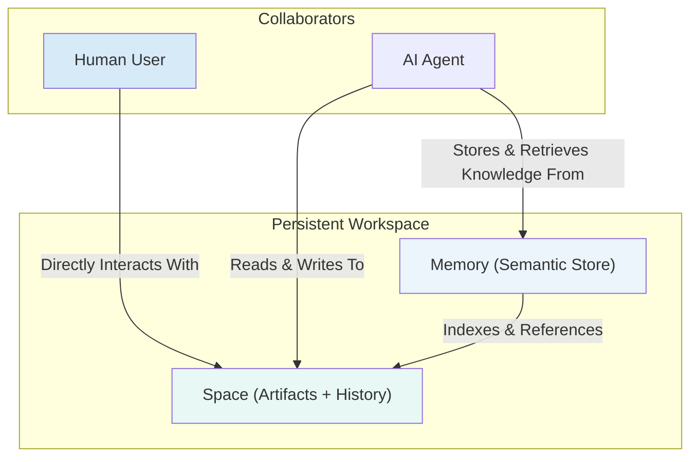

# The Persistent Workspace: Memory in OpenViber

In OpenViber, "memory" is more than just conversation history. It's a foundational pillar of the framework, designed to provide a durable, shared context for both human and AI collaborators. This enables the truly resumable and transparent sessions that are central to the Vibe-X philosophy—**and it now lives by default on the work machine under `~/.openviber/`**, mirroring OpenClaw’s `~/.openclaw` approach so context survives channel changes.

This system is built on a powerful, dual-component model: **The Space** and **The Memory**.



## 1. The Space: The Human's Source of Truth (workspace-first)

The **Space** is the tangible, human-readable part of the project's memory. It contains all the artifacts and auditable records of a project.

**Key Characteristics:**

- **Human-Readable & Navigable**: You can browse artifacts, view version history, and interact with the files just like any other project.
- **Source of Truth**: It holds the definitive outputs of the project—the source code, the research documents, the generated reports.
- **Version Controlled**: Every change to the artifacts is tracked with version history, providing a complete, auditable record of the project.
- **Structured by Default**: Viber provides a default structure, but it's flexible enough to accommodate any project's needs.

**Default workspace layout (`~/.openviber/workspace/`):**

```
workspace/
├── task.md                 # current plan / to-do
├── MEMORY.md               # curated long-term notes
├── memory/YYYY-MM-DD.md    # rolling daily notes/logs
├── AGENTS.md / SOUL.md / TOOLS.md / USER.md / IDENTITY.md  # bootstrap docs
└── artifacts/              # optional checked-in artifacts
```

**Space Structure (logical):**

```typescript
interface Space {
  spaceId: string;
  name: string;
  goal: string;

  // Persistent State
  history: XMessage[]; // Full conversation log
  artifacts: Artifact[]; // All generated files (code, docs, etc.)
  plan?: Plan; // Current work plan

  // Runtime
  xAgent: XAgent; // Project manager
  agents: Map<string, Agent>; // Available specialists
}
```

The Space is designed for transparency and human oversight. It's where the work _lives_.

## 2. The Memory: The AI's Long-Term Brain

The **Memory** is the AI-friendly counterpart to the Space. It's a high-performance semantic store (typically a vector database or sqlite+vector extension) that acts as the agent team's long-term, associative brain. By default, indexes are stored locally (e.g., `~/.openviber/memory/{agentId}.sqlite`) built from `workspace/MEMORY.md` and the `workspace/memory/*.md` logs.

**Key Characteristics:**

- **Semantic Retrieval**: Instead of searching by keywords, agents can retrieve information from Memory based on conceptual meaning. For example, an agent can ask, "What were the key decisions made about the authentication system?"
- **Distilled Knowledge**: The Memory doesn't store every byte of every file. Instead, it stores summaries, key decisions, conversation history, and indexed references back to the full artifacts in the Space.
- **Contextual Awareness**: It provides the agents with the necessary context to perform their tasks without being overwhelmed by the entire project history. It allows an agent to "remember" relevant past interactions and decisions.
- **Performance-Optimized**: It's designed for fast lookups, which is crucial for keeping the AI's reasoning process efficient.

The Memory is how the AI _understands_ the work that lives in the Space.

## 3. How They Work Together: The Collaborative Synergy

The power of Viber's memory system comes from the synergy between the Space and the Memory. They are not independent silos; they work together in a continuous loop.

1. An **agent** might be tasked with writing a new chapter of a technical document.
2. It first queries the **Memory** to understand the context: "Summarize the previous chapter and find the key points about the database schema."
3. The **Memory** provides a concise summary and references to the relevant source files in the Space (e.g., `artifacts/db_schema.sql`).
4. The agent then reads the full content of `db_schema.sql` from the **Space**.
5. After drafting the new chapter, the agent writes the new file (`artifacts/chapter_3.md`) to the **Space**.
6. Finally, it stores a summary of the new chapter and any key decisions made during the writing process back into the **Memory** for future reference.

## 4. Context Accumulation

A key feature of Space-oriented design is **context accumulation**:

```typescript
// Traditional: Each call is independent
const result1 = await agent.run("Research X"); // Context: just "Research X"
const result2 = await agent.run("Write about X"); // Context: just "Write about X"

// Viber: Context accumulates within a Space
await xAgent.streamText({
  messages: [{ role: "user", content: "Research climate change" }],
});
// Context: research request

await xAgent.streamText({
  messages: [{ role: "user", content: "Focus on agriculture impacts" }],
});
// Context: research + agriculture focus

await xAgent.streamText({
  messages: [{ role: "user", content: "Write a summary" }],
});
// Context: research + agriculture + all findings
// XAgent knows everything discussed
```

## 5. Context Window Management

For long-running Spaces, context is managed intelligently:

```typescript
interface ContextManager {
  // Get relevant context for current request
  getRelevantContext(query: string, tokenLimit: number): Promise<XMessage[]>;

  // Summarize old context
  summarizeOldMessages(): Promise<void>;

  // Retrieve by artifact
  getContextForArtifact(artifactId: string): XMessage[];
}
```

## 6. Storage: local by default, pluggable when needed

| Tier                 | Default path                          | Contents / purpose                               |
| -------------------- | ------------------------------------- | ------------------------------------------------ |
| Workspace (Space)    | `~/.openviber/workspace/`                 | Human-readable plan, notes, artifacts            |
| Session logs         | `~/.openviber/agents/{id}/sessions/*.jsonl` | Full transcripts for durability/audit            |
| Memory index         | `~/.openviber/memory/{id}.sqlite`         | Semantic index over MEMORY.md + daily logs       |
| Artifacts (blobs)    | `~/.openviber/artifacts/{taskId}/`        | Large outputs not checked into workspace         |

Adapters remain pluggable (e.g., Supabase) for teams that want shared remote storage, but the **default** is local-first so switching chat surfaces doesn’t drop context.
