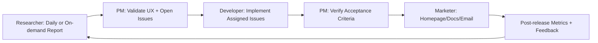

# Parallel Teammates Operating Model

This document defines how OpenViber can run **four AI teammates in parallel** to continuously improve product quality, delivery speed, and user communication:

1. **Researcher** — tracks industry/product/open-source updates and publishes actionable daily reports.
2. **Product Manager** — reviews the product from end-user perspective and opens implementation-ready issues.
3. **Full-Stack Developer** — implements assigned issues across backend and frontend with quality gates.
4. **Marketer** — validates user-facing value, updates homepage/docs, and sends release emails to `hi@openviber.com`.

The goal is to make this a repeatable operating loop with clear ownership, handoffs, and artifacts.

## 1) Objectives

- Keep product direction current with latest ecosystem and market changes.
- Convert observations into actionable engineering work quickly.
- Ensure implementation quality and user-visible polish.
- Close the loop with clear user communication for each meaningful release.

## 2) Role definitions and expected outputs

## 2.1 Researcher

### Mission

Continuously discover useful external signals and transform them into internal learning and feature opportunities.

### Cadence

- **Default**: once per day (scheduled).
- **On-demand**: whenever explicitly requested by manager/user.

### Inputs

- Industry/product/news sources.
- Open-source project releases and changelogs.
- Community discussions and benchmark trends.
- OpenViber strategy context and existing roadmap.

### Outputs (required)

A complete markdown report under `workspace/reports/research/YYYY-MM-DD.md` with:

- Executive summary.
- Top updates worth attention.
- Relevance to OpenViber.
- What to learn (skills, patterns, tooling).
- Feature opportunities (with impact/effort estimate).
- Risks/watchlist.
- Suggested PM tickets.

### Definition of done

- Report is complete, dated, and actionable.
- At least one section maps findings to concrete product opportunities.
- References/sources are preserved for traceability.

## 2.2 Product Manager

### Mission

Represent end users, verify product experience, and maintain a high-quality issue backlog.

### Cadence

- Triggered after each researcher report and after each release candidate.
- Can run ad-hoc exploratory review sessions.

### Inputs

- Researcher reports.
- Product usage walkthroughs.
- User feedback and support signals.
- Existing open issues and roadmap priorities.

### Outputs (required)

Issues in tracker with two types:

- **Bug report**
- **Feature request**

Each issue should include:

- User problem statement.
- Reproduction steps (for bugs).
- Expected vs actual behavior.
- Acceptance criteria (testable).
- Priority and rationale.
- Dependencies and rollout notes (if relevant).

### Definition of done

- New findings are translated into issues (or explicitly rejected with reason).
- Each issue is implementation-ready and assignable.

## 2.3 Full-Stack Developer

### Mission

Deliver robust backend/frontend implementation for assigned issues with strong quality controls.

### Cadence

- Runs whenever a new issue is opened and assigned.

### Inputs

- Assigned issue.
- Product constraints and architecture docs.
- Existing code and test suite.

### Outputs (required)

- Code changes (backend/frontend).
- Tests and validation evidence.
- Short implementation report with risks and follow-up items.

### Quality policy

- Follow existing architecture and coding conventions.
- Run static/type/test checks before merge.
- Use assistant tooling (including Gemini-style review workflows if configured) for design and code quality feedback.
- Include UI verification artifacts (screenshots/videos) for visible changes.

### Definition of done

- Acceptance criteria met.
- Required checks pass.
- PR contains clear summary and verification evidence.

## 2.4 Marketer

### Mission

Ensure value is visible to users and communicate product improvements effectively.

### Cadence

- Triggered for every release containing user-facing changes.

### Inputs

- Merged feature/bug-fix PRs.
- PM release notes and user value statements.
- Product verification walkthrough results.

### Outputs (required)

- Homepage updates (positioning, feature highlights, CTA updates).
- Documentation updates (what changed, how to use).
- Release email sent to `hi@openviber.com` (default fixed address in this scenario).

### Definition of done

- Website/docs reflect latest shipped value.
- Release communication is sent and archived.
- Messaging maps features to clear user benefits.

## 3) End-to-end workflow



## 4) Operational design

## 4.1 Work orchestration

Use an event-driven queue where each role listens for specific triggers:

- `research.daily` or `research.requested` -> Researcher job
- `report.published` -> PM triage job
- `issue.assigned` -> Developer implementation job
- `release.ready` -> Marketer communication job

Each job writes artifacts and status to a shared task store.

## 4.2 Shared artifacts and directories

Recommended structure:

```text
workspace/
  reports/
    research/YYYY-MM-DD.md
  pm/
    triage/YYYY-MM-DD.md
  dev/
    issue-<id>/implementation.md
  marketing/
    release-<version>.md
```

## 4.3 Role contracts (handoff schema)

Define minimal JSON contracts to make handoffs machine-readable:

- **Research -> PM**
  - `report_id`, `date`, `opportunities[]`, `risks[]`, `suggested_issues[]`
- **PM -> Dev**
  - `issue_id`, `type`, `priority`, `acceptance_criteria[]`, `context_links[]`
- **Dev -> Marketing**
  - `release_items[]`, `user_impact`, `docs_needed`, `screenshots[]`

## 4.4 Prioritization model

Use a lightweight score for PM triage:

`priority_score = user_impact * confidence * urgency / implementation_effort`

Use score bands:

- `>= 8`: ship now
- `5-7.9`: near-term backlog
- `< 5`: monitor/park

## 5) Feasibility validation against current OpenViber design

This section validates what can be implemented immediately using current project design and what requires gap work.

| Capability                              | Current design coverage                                             | Feasibility now | Gap summary                                                                     |
| --------------------------------------- | ------------------------------------------------------------------- | --------------- | ------------------------------------------------------------------------------- |
| Multi-agent runtime and role separation | `docs/design/multi-agent-collaboration.md` and daemon runtime model | **High**        | Need explicit role templates for the four teammate personas                     |
| Task state flow and checkpoints         | `docs/design/task-lifecycle.md`                                     | **High**        | Need role-specific lifecycle checkpoints and SLA enforcement                    |
| Plan/artifact persistence               | `docs/design/plan-and-artifacts.md`                                 | **High**        | Need standardized directories and schemas for research/PM/dev/marketing outputs |
| Personalization and role behavior files | `docs/design/personalization.md`                                    | **Medium**      | Need per-role agent YAML and prompt contract conventions                        |
| Messaging and integration surfaces      | `docs/design/communication.md` + `docs/design/protocol.md`          | **Medium**      | Need new event types and payload contracts for inter-role handoffs              |
| Quality and fault handling              | `docs/design/error-handling.md`                                     | **Medium**      | Need hard quality gates for implementation and release-readiness                |
| Outbound communication (release email)  | No concrete email sender design yet                                 | **Low-Medium**  | Need secure email tooling, allowlist, dry-run, and audit log support            |

### 5.1 Feasibility conclusion

- The scenario is **feasible with current architecture direction**.
- Most gaps are **productization gaps** (templates, events, guardrails, and automation), not foundational blockers.
- Recommended path: implement in staged rollout and measure reliability before full automation.

### 5.2 Dependencies and assumptions

- Daemon remains the orchestrator for role execution and handoffs.
- Issue tracker integration is available for PM ticket creation and assignment workflows.
- CI/CD supports required checks for dev quality gates.
- Email delivery path can be integrated safely with destination controls (`hi@openviber.com`).

## 6) Gap backlog (issues to open)

Open the following issues to close feasibility gaps.

### OVB-PT-001 — Add four teammate agent templates

- **Type**: Feature
- **Owner**: Platform
- **Problem**: No first-class role definitions for researcher/PM/developer/marketer.
- **Scope**:
  - Add `~/.openviber/agents/researcher.yaml`
  - Add `~/.openviber/agents/product-manager.yaml`
  - Add `~/.openviber/agents/fullstack-developer.yaml`
  - Add `~/.openviber/agents/marketer.yaml`
  - Define role prompt contracts and output formats
- **Acceptance criteria**:
  - Each role can be instantiated deterministically.
  - Each role emits output in required markdown template.

### OVB-PT-002 — Implement daily researcher scheduler and report template

- **Type**: Feature
- **Owner**: Daemon
- **Problem**: No scheduler-based daily research run and standardized report output.
- **Scope**:
  - Add `research.daily` schedule trigger.
  - Add on-demand `research.requested` trigger path.
  - Add canonical report template under workspace artifacts.
- **Acceptance criteria**:
  - Daily run executes once per configured interval.
  - Report file is generated with required sections.

### OVB-PT-003 — PM triage automation from research report

- **Type**: Feature
- **Owner**: Product tooling
- **Problem**: No automated conversion from report opportunities to issue drafts.
- **Scope**:
  - Implement `report.published` event handler.
  - Add issue templates for bug and feature request.
  - Preserve source traceability links.
- **Acceptance criteria**:
  - PM receives issue drafts with required fields populated.
  - Every draft links back to source report evidence.

### OVB-PT-004 — Role handoff event contracts

- **Type**: Feature
- **Owner**: Protocol/daemon
- **Problem**: Event schema for inter-role contracts is not standardized.
- **Scope**:
  - Define JSON schema for Research -> PM, PM -> Dev, Dev -> Marketing.
  - Validate payloads and reject malformed events.
  - Add schema versioning strategy.
- **Acceptance criteria**:
  - Invalid payloads are rejected with actionable errors.
  - Backward compatibility policy documented.

### OVB-PT-005 — Developer quality-gate pipeline for assigned issues

- **Type**: Feature
- **Owner**: Engineering productivity
- **Problem**: No mandatory policy binding assigned issue completion to quality checks.
- **Scope**:
  - Require lint/typecheck/test checks before completion.
  - Require verification artifact for visual changes.
  - Add implementation report template.
- **Acceptance criteria**:
  - Assigned issue cannot be marked done if checks fail.
  - PR/report includes verification evidence.

### OVB-PT-006 — PM acceptance verification checklist

- **Type**: Feature
- **Owner**: Product quality
- **Problem**: Final user-perspective acceptance step is inconsistent.
- **Scope**:
  - Add PM acceptance checklist template.
  - Record expected vs actual outcome per acceptance criterion.
  - Block release-ready state until checklist passes.
- **Acceptance criteria**:
  - Release-ready transition enforces checklist completion.
  - Checklist artifact is stored with issue/release evidence.

### OVB-PT-007 — Marketer release workflow (homepage/docs/email)

- **Type**: Feature
- **Owner**: Growth
- **Problem**: No integrated workflow for release messaging and publication.
- **Scope**:
  - Add `release.ready` marketer workflow.
  - Add homepage/docs change checklist.
  - Add release note template with user-value framing.
- **Acceptance criteria**:
  - Marketer receives actionable release package from dev outputs.
  - Homepage/docs updates are traceable per release.

### OVB-PT-008 — Secure outbound email integration with allowlist

- **Type**: Feature / Security
- **Owner**: Platform security
- **Problem**: Email delivery needed for release notifications but lacks guardrails.
- **Scope**:
  - Add email sender tool integration.
  - Enforce destination allowlist including `hi@openviber.com`.
  - Add dry-run mode and audit log.
- **Acceptance criteria**:
  - Non-allowlisted destination is blocked.
  - Every send has auditable metadata and content snapshot.

### OVB-PT-009 — Metrics dashboard for four-role operating loop

- **Type**: Feature
- **Owner**: Observability
- **Problem**: No single visibility layer for throughput and quality of the four-role loop.
- **Scope**:
  - Track role SLAs from section 8.
  - Add weekly summary and trend views.
  - Highlight bottlenecks by lifecycle stage.
- **Acceptance criteria**:
  - Dashboard exposes role-level and end-to-end latency.
  - Team can identify top 3 bottlenecks each week.

## 7) Implementation plan

## Phase 1 — Foundation (Week 1)

- Add teammate role configs under `~/.openviber/agents/`:
  - `researcher.yaml`
  - `product-manager.yaml`
  - `fullstack-developer.yaml`
  - `marketer.yaml`
- Define prompt templates for each role (mission, inputs, output format, DoD).
- Create report/issue/marketing markdown templates.
- Add scheduler trigger for daily researcher run.

**Exit criteria**: researcher can produce daily report and PM can open structured issues from it.

## Phase 2 — Handoffs and automation (Week 2)

- Implement event hooks between report publication, issue creation, assignment, and release readiness.
- Implement issue template enforcement (required fields).
- Add artifact linking so each issue references source report sections.

**Exit criteria**: end-to-end handoff works without manual copy/paste.

## Phase 3 — Quality gates and verification (Week 3)

- Add mandatory developer checks (typecheck, tests, lint, UI verification for visual changes).
- Add PM acceptance review checklist.
- Add marketer release checklist (homepage/docs/email).

**Exit criteria**: each release has verifiable quality and communication artifacts.

## Phase 4 — Metrics and optimization (Week 4+)

- Track delivery and impact metrics (see section 8).
- Tune prioritization, report quality rubric, and release comms quality.
- Add monthly retrospective auto-summary.

**Exit criteria**: measurable improvement in throughput and user-facing clarity.

## 8) Metrics and SLAs

### Researcher

- Daily report completion rate.
- % of suggestions converted to PM issues.
- Signal quality score (PM-rated usefulness).

### Product Manager

- Issue readiness score.
- Time from report publication to issue creation.
- Acceptance criteria clarity (developer-rated).

### Developer

- Lead time from assignment to merge.
- Change failure rate.
- Reopen rate of closed issues.

### Marketer

- Time from release-ready to comms published.
- Docs freshness lag.
- Email open/click proxy metrics (if available).

## 9) Risk management

- **Noise overload in research**: enforce strict “actionability” rubric.
- **Low-quality issues**: require PM templates with mandatory acceptance criteria.
- **Implementation drift**: automated checks and PM acceptance sign-off.
- **Overclaim in marketing**: require linkage to shipped functionality and screenshots.
- **Email misuse risk**: enforce allowlist policy and dry-run mode before send.

## 10) Security and governance notes

- Keep external-source references auditable.
- Restrict outbound email tool to approved destination(s), including `hi@openviber.com`.
- Store release communications in versioned markdown before sending.
- Ensure role actions are logged with timestamps and artifact links.

## 11) Practical kickoff checklist

- [ ] Create 4 role configs and prompts.
- [ ] Add daily researcher scheduler.
- [ ] Add PM issue templates and triage workflow.
- [ ] Add dev quality gate pipeline and PR evidence requirements.
- [ ] Add marketer release checklist and email sender integration.
- [ ] Add metrics dashboard and weekly review ritual.

---

This operating model is intentionally iterative: start with simple role outputs, then strengthen handoffs, quality gates, and measurement.
