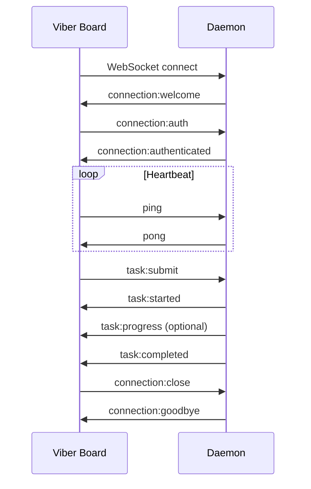

# WebSocket Protocol

This document specifies the WebSocket protocol between Viber Board (client) and the daemon (server). The protocol is designed for stateless operation with explicit message contracts.

## 1. Connection Lifecycle



## 2. Message Envelope

All messages follow a common envelope:

```typescript
interface Message {
  type: string;              // Message type (e.g., "task:submit")
  id: string;                // Unique message ID (UUID)
  timestamp: string;         // ISO 8601 timestamp
  payload: object;           // Type-specific payload
}
```

### Example

```json
{
  "type": "task:submit",
  "id": "550e8400-e29b-41d4-a716-446655440000",
  "timestamp": "2024-01-15T10:30:00.000Z",
  "payload": {
    "goal": "Build a landing page",
    "messages": []
  }
}
```

## 3. Connection Messages

### `connection:welcome` (Server → Client)

Sent immediately after WebSocket connection is established.

```typescript
interface ConnectionWelcome {
  type: "connection:welcome";
  payload: {
    daemon_version: string;      // e.g., "1.2.0"
    protocol_version: string;    // e.g., "1"
    challenge: string;           // Nonce for authentication
    capabilities: string[];      // ["streaming", "terminal", "approval"]
  };
}
```

### `connection:auth` (Client → Server)

Client authenticates with the daemon.

```typescript
interface ConnectionAuth {
  type: "connection:auth";
  payload: {
    device_id: string;           // Unique device identifier
    token?: string;              // Optional auth token
    challenge_response?: string; // Signed challenge (if required)
    role: "operator" | "node";   // Client role
    scopes: string[];            // Requested permissions
  };
}
```

### `connection:authenticated` (Server → Client)

Confirms successful authentication.

```typescript
interface ConnectionAuthenticated {
  type: "connection:authenticated";
  payload: {
    session_id: string;          // Session identifier
    granted_scopes: string[];    // Approved permissions
    expires_at?: string;         // Session expiry (optional)
  };
}
```

### `connection:error` (Server → Client)

Authentication or connection error.

```typescript
interface ConnectionError {
  type: "connection:error";
  payload: {
    code: "auth_failed" | "invalid_token" | "rate_limited" | "protocol_error";
    message: string;
    retry_after_ms?: number;     // For rate limiting
  };
}
```

### `connection:close` (Either direction)

Graceful connection close.

```typescript
interface ConnectionClose {
  type: "connection:close";
  payload: {
    reason?: string;
  };
}
```

## 4. Task Messages

### `task:submit` (Client → Server)

Submit a new task for execution.

```typescript
interface TaskSubmit {
  type: "task:submit";
  payload: {
    idempotency_key: string;     // Deduplication key
    goal: string;                // Task objective
    messages: Message[];         // Conversation history
    plan?: Plan;                 // Optional plan context
    artifacts?: ArtifactRef[];   // Optional artifact references
    memory?: string;             // Optional memory excerpt
    options?: {
      mode?: "always_ask" | "agent_decides" | "always_execute";
      stream_deltas?: boolean;   // Request token-level streaming
      max_tokens?: number;
      timeout_ms?: number;
    };
  };
}

interface Message {
  role: "user" | "assistant" | "system";
  content: string;
  tool_calls?: ToolCall[];
  tool_results?: ToolResult[];
}

interface Plan {
  format: "markdown" | "structured";
  content: string | StructuredPlan;
}

interface StructuredPlan {
  goal: string;
  steps: Array<{
    id: string;
    title: string;
    status: "pending" | "in_progress" | "completed" | "blocked";
  }>;
}

interface ArtifactRef {
  id: string;
  title?: string;
  type?: string;                 // "file" | "screenshot" | "log"
  ref?: string;                  // Path or URL
}
```

### `task:started` (Server → Client)

Confirms task execution has begun.

```typescript
interface TaskStarted {
  type: "task:started";
  payload: {
    task_id: string;             // Server-assigned task ID
    idempotency_key: string;     // Echo back for correlation
    started_at: string;
  };
}
```

### `task:progress` (Server → Client)

Optional periodic progress update.

```typescript
interface TaskProgress {
  type: "task:progress";
  payload: {
    task_id: string;
    status: "planning" | "executing" | "verifying";
    current_step?: string;       // Current plan step
    tokens_used?: number;
    cost_estimate_usd?: number;
    message?: string;            // Human-readable status
  };
}
```

### `task:delta` (Server → Client)

Token-level streaming delta (only if `stream_deltas: true`).

```typescript
interface TaskDelta {
  type: "task:delta";
  payload: {
    task_id: string;
    delta_type: "text" | "tool_call" | "tool_result";
    text?: string;               // For text deltas
    tool_call?: {
      id: string;
      name: string;
      arguments: string;         // May be partial JSON
    };
    tool_result?: {
      tool_call_id: string;
      result: unknown;
    };
  };
}
```

### `task:completed` (Server → Client)

Task finished successfully.

```typescript
interface TaskCompleted {
  type: "task:completed";
  payload: {
    task_id: string;
    result: {
      text: string;              // Full assistant response
      summary?: string;          // Optional concise summary
      artifact_refs?: ArtifactRef[];
      plan_updates?: string;     // Suggested plan changes (if applicable)
    };
    usage: {
      prompt_tokens: number;
      completion_tokens: number;
      total_tokens: number;
      cost_usd?: number;
    };
    completed_at: string;
  };
}
```

### `task:error` (Server → Client)

Task failed.

```typescript
interface TaskError {
  type: "task:error";
  payload: {
    task_id: string;
    error: {
      type: string;              // Error category
      message: string;
      recoverable: boolean;
      suggestion?: string;
    };
    partial_result?: {
      text: string;              // Any partial output
    };
    usage?: {
      prompt_tokens: number;
      completion_tokens: number;
      total_tokens: number;
    };
  };
}
```

### `task:stop` (Client → Server)

Request to stop a running task.

```typescript
interface TaskStop {
  type: "task:stop";
  payload: {
    task_id: string;
    reason?: string;
  };
}
```

### `task:stopped` (Server → Client)

Confirms task was stopped.

```typescript
interface TaskStopped {
  type: "task:stopped";
  payload: {
    task_id: string;
    partial_result?: {
      text: string;
    };
  };
}
```

### `task:message` (Client → Server)

Send a follow-up message to an in-progress task.

```typescript
interface TaskMessage {
  type: "task:message";
  payload: {
    task_id: string;
    message: Message;
    injection_mode: "steer" | "followup" | "collect";
  };
}
```

## 5. Approval Messages

### `approval:required` (Server → Client)

A tool requires human approval before execution.

```typescript
interface ApprovalRequired {
  type: "approval:required";
  payload: {
    task_id: string;
    approval_id: string;
    tool_call: {
      id: string;
      name: string;
      arguments: object;
    };
    reason: string;              // Why approval is needed
    timeout_ms?: number;         // Auto-reject after timeout
  };
}
```

### `approval:response` (Client → Server)

Human responds to approval request.

```typescript
interface ApprovalResponse {
  type: "approval:response";
  payload: {
    approval_id: string;
    approved: boolean;
    reason?: string;             // Optional explanation
  };
}
```

## 6. Terminal Messages

### `terminal:list` (Client → Server)

Request list of active terminals.

```typescript
interface TerminalList {
  type: "terminal:list";
  payload: {};
}
```

### `terminal:list_response` (Server → Client)

```typescript
interface TerminalListResponse {
  type: "terminal:list_response";
  payload: {
    terminals: Array<{
      id: string;
      name: string;
      created_at: string;
      size: { rows: number; cols: number };
    }>;
  };
}
```

### `terminal:attach` (Client → Server)

Attach to a terminal for streaming output.

```typescript
interface TerminalAttach {
  type: "terminal:attach";
  payload: {
    terminal_id: string;
  };
}
```

### `terminal:output` (Server → Client)

Terminal output chunk.

```typescript
interface TerminalOutput {
  type: "terminal:output";
  payload: {
    terminal_id: string;
    data: string;                // Raw terminal output
  };
}
```

### `terminal:input` (Client → Server)

Send input to terminal.

```typescript
interface TerminalInput {
  type: "terminal:input";
  payload: {
    terminal_id: string;
    data: string;
  };
}
```

### `terminal:resize` (Client → Server)

Resize terminal.

```typescript
interface TerminalResize {
  type: "terminal:resize";
  payload: {
    terminal_id: string;
    rows: number;
    cols: number;
  };
}
```

### `terminal:detach` (Client → Server)

Stop receiving terminal output.

```typescript
interface TerminalDetach {
  type: "terminal:detach";
  payload: {
    terminal_id: string;
  };
}
```

## 7. Health & Status Messages

### `health:ping` / `health:pong`

Heartbeat to keep connection alive and detect failures.

```typescript
interface HealthPing {
  type: "health:ping";
  payload: {
    client_time: string;
  };
}

interface HealthPong {
  type: "health:pong";
  payload: {
    server_time: string;
    latency_ms: number;
  };
}
```

### `status:agent` (Server → Client)

Push notification of agent status change.

```typescript
interface StatusAgent {
  type: "status:agent";
  payload: {
    agent_id: string;
    status: "idle" | "running" | "paused" | "error";
    current_task_id?: string;
    budget_used_usd?: number;
    budget_limit_usd?: number;
  };
}
```

## 8. Error Codes

| Code | Meaning |
|------|---------|
| `auth_failed` | Authentication credentials invalid |
| `invalid_token` | Token expired or malformed |
| `rate_limited` | Too many requests |
| `protocol_error` | Malformed message |
| `task_not_found` | Referenced task doesn't exist |
| `already_running` | Task with same idempotency key in progress |
| `budget_exceeded` | Cost limit reached |
| `approval_timeout` | Approval not received in time |
| `internal_error` | Unexpected server error |

## 9. Protocol Versioning

The protocol version is exchanged in `connection:welcome`. Clients should check compatibility:

```typescript
const SUPPORTED_PROTOCOL_VERSIONS = ["1"];

function checkCompatibility(serverVersion: string): boolean {
  return SUPPORTED_PROTOCOL_VERSIONS.includes(serverVersion);
}
```

Breaking changes increment the major version. Additive changes (new message types, new optional fields) are backward compatible.

## 10. Security Considerations

- **TLS required** for non-localhost connections
- **Challenge-response** authentication prevents replay attacks
- **Idempotency keys** prevent duplicate task execution
- **Session tokens** should expire and be rotatable
- **Scopes** limit what operations a client can perform

---

## Quick Reference

| Direction | Message Type | Purpose |
|-----------|--------------|---------|
| S → C | `connection:welcome` | Initial handshake |
| C → S | `connection:auth` | Authenticate |
| S → C | `connection:authenticated` | Confirm auth |
| C → S | `task:submit` | Start task |
| S → C | `task:started` | Acknowledge |
| S → C | `task:progress` | Status update |
| S → C | `task:delta` | Streaming token |
| S → C | `task:completed` | Success |
| S → C | `task:error` | Failure |
| C → S | `task:stop` | Cancel task |
| S → C | `approval:required` | Request approval |
| C → S | `approval:response` | Grant/deny |
| C → S | `terminal:attach` | Stream terminal |
| S → C | `terminal:output` | Terminal data |
| Both | `health:ping/pong` | Keepalive |
