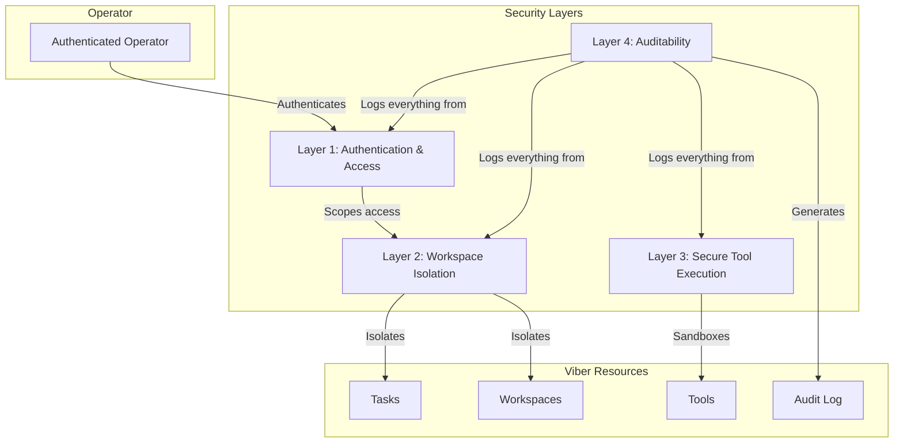
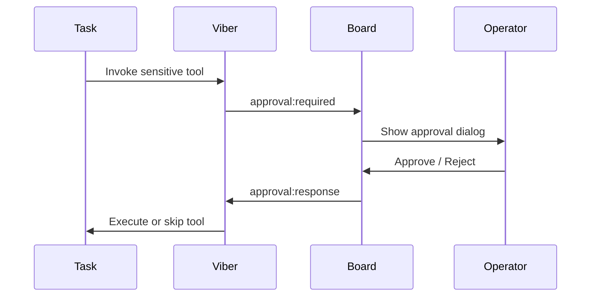

# Security & Isolation

OpenViber is designed with a security-first mindset — tasks execute real tools on real machines, so isolation, auditability, and human oversight are non-negotiable. This document describes the layered security model that governs task execution.

---

## 1. Security Layers



---

### Layer 1: Authentication & Access

All interactions with an OpenViber machine (Viber) are mediated by the [WebSocket protocol](./protocol.md) authentication flow.

- **Connection authentication**: Clients authenticate during the WebSocket handshake using device certificates or tokens (see [Viber Onboarding](#5-viber-onboarding) below).
- **Role-based scoping**: Clients declare their role (`operator` or `viber`) and requested scopes at connection time. The Viber grants only the permissions appropriate for that role.
- **Task-scoped operations**: Each task has its own configuration, memory, and sessions. API operations are implicitly scoped to the target task.

### Layer 2: Workspace Isolation

Workspaces (called **Spaces** in [viber.md](./viber.md)) are working directories where tasks operate — repos, research folders, output directories.

- **Filesystem isolation**: Each task declares which spaces it can access in its config. Path traversal is prevented by resolving all file paths relative to declared space roots.
- **Memory isolation**: Each task has its own `soul.md`, `memory.md`, and session history (see [personalization.md](./personalization.md)). A task cannot read another task's memory.
- **Config isolation**: Task configurations (`~/.openviber/vibers/{id}.yaml`) are individually loaded. One task's tool permissions, budget, and model settings are independent of another's.

```yaml
# ~/.openviber/vibers/dev.yaml
spaces:
  - ~/openviber_spaces/my-webapp    # Can access this
  - ~/code/legacy-api               # And this
  # Cannot access anything else on the filesystem
```

### Layer 3: Secure Tool Execution

Tasks do not have unrestricted system access. All interactions with the OS, network, and external services are mediated through the tool system.

- **Declarative tool permissions**: The specific tools a task can use are listed in its configuration. A task cannot invoke tools not granted to it.
- **Human-in-the-loop approval**: Sensitive tools can require operator approval before execution. The approval flow uses the `approval:required` / `approval:response` messages defined in the [protocol](./protocol.md).
- **Parameter validation**: Tool arguments are validated against schemas before execution, preventing malformed calls and injection attacks.

```yaml
# ~/.openviber/vibers/dev.yaml
tools:
  - file
  - search
  - web
  - browser
  - tmux
require_approval:
  - file.write     # Writing files needs approval
  - tmux.execute   # Running commands needs approval
```

#### Container Sandboxing (Optional)

For defense-in-depth, tool execution can run inside containers:

| Setting | Options | Default |
|---------|---------|---------|
| **sandbox** | `off`, `non-main`, `all` | `off` |
| **scope** | `session`, `task`, `shared` | `session` |
| **workspace_access** | `none`, `ro`, `rw` | `rw` |

- `non-main` sandboxes background and auto-reply sessions while leaving interactive sessions on the host.
- `all` sandboxes every session — maximum isolation.
- **Elevated tools** (e.g., desktop interaction, system settings) bypass sandboxing and require stricter approval policies.

### Layer 4: Auditability & Observability

Every action taken by a task is logged to session JSONL files:

- **Comprehensive trail**: Every tool call, tool result, model response, and operator intervention is recorded.
- **Real-time observability**: The Board provides terminal streaming (via tmux), task status updates, and artifact browsing — operators can watch tasks work in real time (see [viber.md](./viber.md) human control model).
- **Forensic analysis**: Session logs provide a complete replay of task behavior for debugging or incident review.

---

## 2. Budget Controls

Budget limits are a core security mechanism — they prevent tasks from running up costs or executing indefinitely.

| Control | Scope | Behavior |
|---------|-------|----------|
| **Token budget** | Per-task | Task pauses when limit reached |
| **Cost limit (USD)** | Per-task or per-day | Task transitions to Paused state |
| **Execution timeout** | Per-task | Task stopped after timeout |
| **Tool call limit** | Per-task | Task escalates to operator after N tool calls |

Budget status is reported via `status:viber` messages and visible in the Board's status panel. See [error-handling.md](./error-handling.md) for budget exhaustion recovery flows.

---

## 3. Storage Security

### Local Storage (Default)

OpenViber stores all data locally by default:

- **SQLite** for structured data (session metadata, task state).
- **Filesystem** for artifacts, configs, and session JSONL logs.
- **No network exposure** — the Viber only makes outbound connections (to LLM providers and the Board).
- **Directory-based separation** — config in `~/.openviber/`, working data in declared spaces.

### Cloud Storage (Optional)

For teams or multi-device setups, cloud storage can sync task state:

- **Row-Level Security (RLS)** policies enforce user isolation in shared databases.
- **Encrypted connections (TLS)** for all cloud communication.
- **Service role separation** — client keys never have admin access.

```sql
-- Example RLS policy for shared cloud storage
CREATE POLICY "Users can only access their own tasks"
ON viber_sessions
FOR ALL
USING (user_id = auth.uid());
```

---

## 4. Tool Approval Flow

For sensitive operations, the protocol supports human-in-the-loop approval:



Approval requests include:

- **Tool name and arguments** — what the task wants to do.
- **Reason** — why the task thinks this action is needed.
- **Timeout** — auto-reject if operator doesn't respond (configurable, default: 5 minutes).

---

## 5. Viber Onboarding

Viber registration follows a **Cloudflare Zero Trust** pattern — the Board generates a one-time token, the operator runs a single command, and the Viber connects outbound. See also [viber.md](./viber.md) for the full onboarding flow.

```bash
npx openviber connect --token eyJub2RlIjoiYTFiMmMz...
```

### Security Properties

| Property | How |
|----------|-----|
| **One-time token** | Expires after first use or after TTL (default: 15 minutes) |
| **No inbound ports** | Viber connects outbound to the Board via WebSocket |
| **Device binding** | After initial connect, device ID is pinned — reconnections use the bound identity |
| **Revocable** | Board can revoke Viber access at any time |
| **Token contents** | Signed JWT containing: Viber ID, Board URL, expiry, org scope |

### What the Token Does NOT Contain

- No API keys or provider credentials (configured locally in `~/.openviber/config.yaml`).
- No user data or task configurations.
- No long-lived secrets — the token bootstraps a device binding, then is discarded.

### Post-Onboarding

After the initial handshake, the Viber uses a **device certificate** for reconnections. This certificate is stored in `~/.openviber/` and tied to the machine's identity. If the Viber moves to a different machine, the operator must re-pair from the Board.

---

## 6. Design Principles

1. **Outbound-only** — Vibers never open inbound ports. All connectivity is initiated by the Viber.
2. **Least privilege** — tasks can only use tools and access spaces explicitly granted to them.
3. **Human oversight always available** — approval gates, terminal streaming, and budget limits ensure operators stay in control.
4. **Defense in depth** — authentication, workspace isolation, tool sandboxing, and audit logging form independent security layers.
5. **Fail safe** — budget exhaustion pauses (doesn't kill), context overflow compacts (doesn't crash), approval timeout rejects (doesn't auto-approve).
