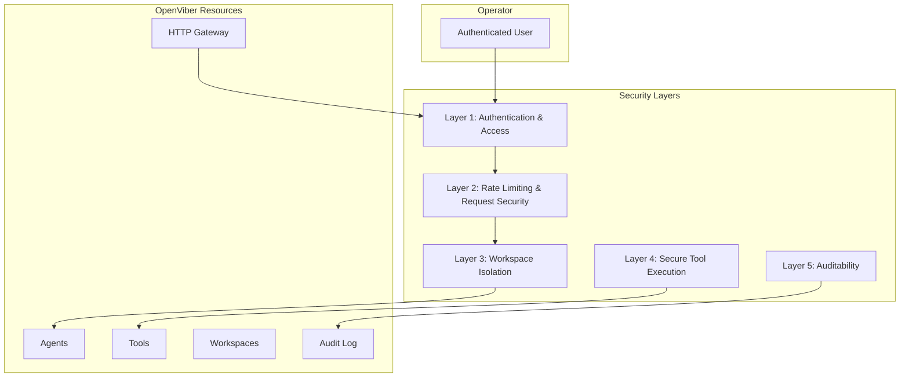
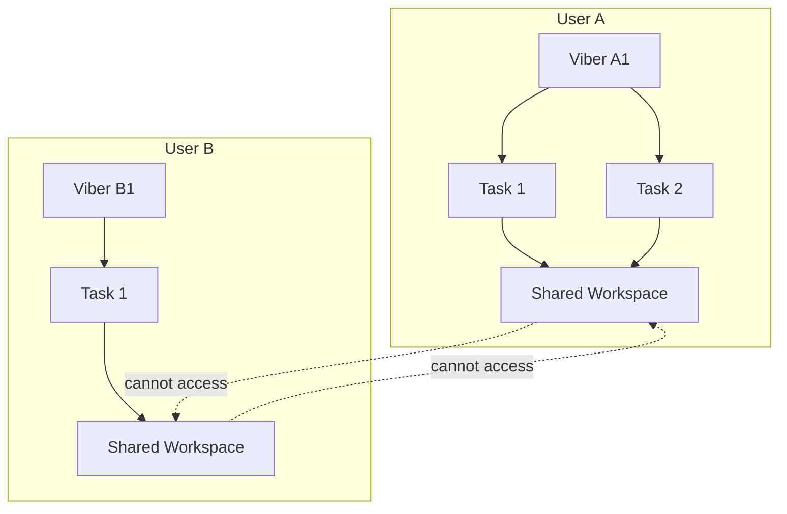
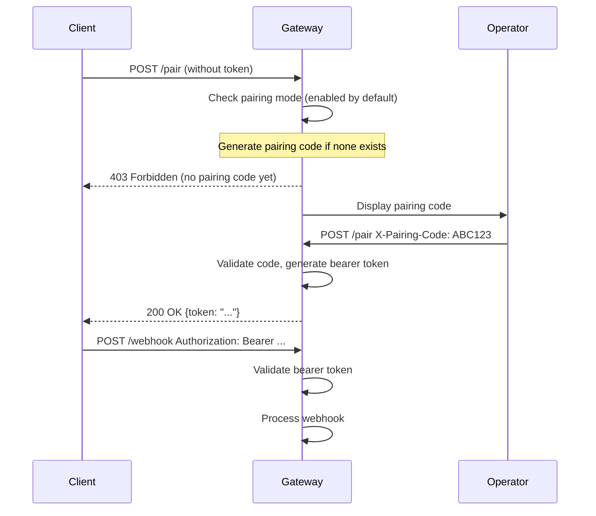
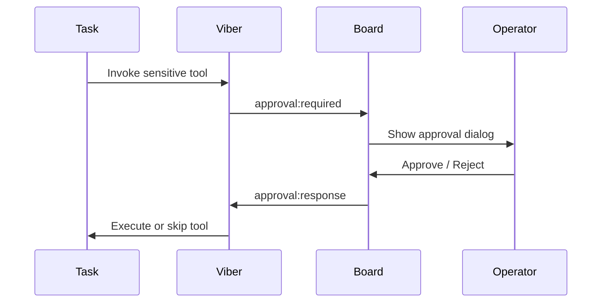

# Security & Isolation

OpenViber is designed with a security-first mindset — agents execute real tools on real machines, so isolation, auditability, and human oversight are non-negotiable. This document describes the layered security model that governs agent and tool execution.

---

## 1. Security Layers



---

### Layer 1: Authentication & Access

OpenViber uses multiple authentication mechanisms depending on the access method:

- **HTTP Gateway**: Uses pairing code exchange for bearer tokens (see `src/gateway/http-gateway.ts`)
  - One-time pairing codes exchanged for bearer tokens
  - Rate limiting on pairing requests (10/minute default)
  - Bearer token required for webhook endpoints
  - Optional webhook secret validation via `X-Webhook-Secret` header

- **WebSocket Viber Connection**: Device certificate/token-based authentication (see protocol.md)
  - Outbound-only connections from Vibers
  - Device binding after initial onboarding
  - Revocable access tokens

- **Web Authentication**: Supabase-based user authentication for Viber Board
  - OAuth providers (GitHub, Google, etc.)
  - Row-level security for multi-tenant data isolation

### Layer 2: Rate Limiting & Request Security

The HTTP Gateway (`src/gateway/http-gateway.ts`) provides protection against abuse:

- **Sliding window rate limiting**: Per-client limits prevent abuse
  - Pair endpoint: 10 requests/minute
  - Webhook endpoint: 60 requests/minute
  - Configurable per-gateway

- **Idempotency handling**: Prevents duplicate processing
  - `X-Idempotency-Key` header for deduplication
  - Configurable TTL (default: 5 minutes)
  - Automatic cleanup of expired keys

- **Request size limits**: Prevents memory exhaustion attacks
  - Max body size enforced before processing
  - Connection timeout limits slow-loris attacks

### Layer 3: Workspace Isolation

The security boundary is at the **Viber level**, not per-task. A Viber belongs to a single user, and all tasks within that Viber share the same workspace.



**Key principles:**

- **Viber-level isolation**: Each Viber has its own workspace directory. Tasks in the same Viber can read and write files in the shared workspace — they belong to the same user and are part of the same workflow.
- **Cross-Viber isolation**: A Viber cannot access another Viber's workspace. Path traversal attacks are prevented by resolving all file paths relative to the Viber's declared space roots.
- **Viber-level memory**: Each Viber has its own `soul.md`, `memory.md`, and session history (see [personalization.md](./personalization.md)). All tasks within a Viber share this memory context.
- **Config isolation**: Viber configurations (`~/.openviber/vibers/{id}.yaml`) define the spaces that Viber's tasks can access.

```yaml
# ~/.openviber/vibers/dev.yaml
spaces:
  - ~/openviber_spaces/my-webapp    # All tasks in this Viber can access
  - ~/code/legacy-api               # All tasks in this Viber can access
  # Cannot access anything else on the filesystem
```

### Layer 4: Secure Tool Execution

All tools implement the `Tool` interface from `src/worker/tool-trait.ts`:

```typescript
interface Tool {
  getSpec(): ToolSpec;
  execute(params: unknown, context: ToolContext): Promise<ToolResult>;
}
```

**Security Context**: Every tool execution receives a `ToolContext` containing:
- `security`: SecurityPolicy with blocked/allowed commands, timeouts, workspace restrictions
- `runtime`: RuntimeAdapter for execution (native, docker, sandbox)
- `spaceId`: The Viber's workspace root (all tasks in a Viber share the same space)
- `userId`: For tracking and RLS policies

**Security Policy** (`src/worker/tool-trait.ts`):
```typescript
interface SecurityPolicy {
  timeoutMs: number;
  restrictToWorkspace: boolean;
  blockedCommands: RegExp[];
  allowedCommands: RegExp[];
  maxOutputSize: number;
  requiresApproval: boolean;
}
```

**Default blocked commands** (conservative):
- `rm -rf /`, `.`, `..`, `*` patterns
- `mkfs`, `dd`, `chown`, `chmod 777`
- Fork bomb patterns
- `sudo`, privilege escalation

**Tool approval flow**:
1. Agent requests tool execution
2. If tool requires approval, agent pauses and requests user approval
3. User approves via metadata.approvedTokens
4. Tool executes with approved context

Tasks do not have unrestricted system access. All interactions with the OS, network, and external services are mediated through the tool system.

- **Declarative tool permissions**: The specific tools a task can use are listed in its configuration. A task cannot invoke tools not granted to it.
- **Human-in-the-loop approval**: Sensitive tools can require operator approval before execution. The approval flow uses the `approval:required` / `approval:response` messages defined in the [protocol](./protocol.md).
- **Parameter validation**: Tool arguments are validated against schemas before execution, preventing malformed calls and injection attacks.

```yaml
# ~/.openviber/vibers/dev.yaml
tools:
  - file
  - search
  - web
  - browser
  - tmux
require_approval:
  - file.write     # Writing files needs approval
  - tmux.execute   # Running commands needs approval
```

#### Runtime Isolation (Optional)

The `RuntimeAdapter` interface (`src/worker/tool-trait.ts`) abstracts execution environments:

- **NativeRuntime** (default): Direct execution on host
- **DockerRuntime** (planned): Containerized execution with resource limits
  - CPU limits
  - Memory limits
  - Read-only root filesystem
  - Workspace mount as read-write

Tools receive the runtime adapter via `ToolContext`, enabling isolation without tool code changes.

For defense-in-depth, Viber execution can run inside containers:

| Setting | Options | Default |
|---------|---------|---------|
| **sandbox** | `off`, `all` | `off` |
| **workspace_access** | `none`, `ro`, `rw` | `rw` |

- `off` runs all Vibers on the host (default).
- `all` sandboxes every Viber in its own container — maximum isolation.
- **Elevated tools** (e.g., desktop interaction, system settings) bypass sandboxing and require stricter approval policies.

**Important**: Sandbox isolation is per-Viber, not per-task. All tasks within a Viber share the same execution environment and workspace.

### Layer 5: Auditability & Observability

All tool executions are logged with:
- **Request ID** for tracing across distributed systems
- **User ID** for accountability
- **Space ID** for multi-tenant context
- **Timestamp** and **result** for forensic analysis

The Viber Board provides real-time observability:
- Task status streaming
- Terminal output via SSE
- Artifact browsing
- Agent communication logs

---

## HTTP Gateway Security

The HTTP Gateway (`src/gateway/http-gateway.ts`) provides external API access with security features:

### Pairing Flow



### Configuration

```typescript
import { createHttpGatewayServer } from './gateway/http-gateway';

const gateway = createHttpGatewayServer({
  host: "127.0.0.1",
  port: 3000,
  requirePairing: true,
  pairRateLimitPerMinute: 10,
  webhookRateLimitPerMinute: 60,
  idempotencyTTLSecs: 300,
  webhookSecret: process.env.WEBHOOK_SECRET,
});
```

### Security Features

| Feature | Default | Description |
|---------|---------|-------------|
| `requirePairing` | `true` | Require pairing before accepting requests |
| `allowPublicBind` | `false` | Block binding to non-localhost without tunnel |
| `webhookSecret` | `undefined` | Validate `X-Webhook-Secret` header (constant-time compare) |
| Idempotency TTL | 300s | How long idempotency keys are remembered |

### Security Checklist

- [x] **Public bind blocked by default** - requires explicit opt-in
- [x] **Pairing required by default** - one-time code exchange
- [x] **Rate limiting** - sliding window per client
- [x] **Constant-time secret comparison** - prevents timing attacks
- [x] **Request timeout** - limits slow-loris attacks
- [x] **No pre-paired tokens** - start clean, add via config

---

## 2. Budget Controls

Budget limits are a core security mechanism — they prevent tasks from running up costs or executing indefinitely.

| Control | Scope | Behavior |
|---------|-------|----------|
| **Token budget** | Per-task | Task pauses when limit reached |
| **Cost limit (USD)** | Per-viber daily limit | All tasks in Viber pause when daily limit reached |
| **Execution timeout** | Per-task | Task stopped after timeout |
| **Tool call limit** | Per-task | Task escalates to operator after N tool calls |

Budget status is reported via `status:viber` messages and visible in the Board's status panel. See [error-handling.md](./error-handling.md) for budget exhaustion recovery flows.

---

## 3. Storage Security

### Local Storage (Default)

OpenViber stores all data locally by default:

- **SQLite** for structured data (session metadata, task state).
- **Filesystem** for artifacts, configs, and session JSONL logs.
- **No network exposure** — the Viber only makes outbound connections (to LLM providers and the Board).
- **Directory-based separation** — config in `~/.openviber/`, working data in declared spaces.

### Cloud Storage (Optional)

For teams or multi-device setups, cloud storage can sync task state:

- **Row-Level Security (RLS)** policies enforce user isolation in shared databases.
- **Encrypted connections (TLS)** for all cloud communication.
- **Service role separation** — client keys never have admin access.

```sql
-- Example RLS policy for shared cloud storage
CREATE POLICY "Users can only access their own tasks"
ON viber_sessions
FOR ALL
USING (user_id = auth.uid());
```

---

## 4. Tool Approval Flow

For sensitive operations, the protocol supports human-in-the-loop approval:



Approval requests include:

- **Tool name and arguments** — what the task wants to do.
- **Reason** — why the task thinks this action is needed.
- **Timeout** — auto-reject if operator doesn't respond (configurable, default: 5 minutes).

---

## 5. Viber Onboarding

Viber registration follows a **Cloudflare Zero Trust** pattern — the Board generates a one-time token, the operator runs a single command, and the Viber connects outbound. See also [viber.md](./viber.md) for the full onboarding flow.

```bash
npx openviber onboard --token eyJub2RlIjoiYTFiMmMz...
```

### Security Properties

| Property | How |
|----------|-----|
| **One-time token** | Expires after first use or after TTL (default: 15 minutes) |
| **No inbound ports** | Viber connects outbound to the Board via WebSocket |
| **Device binding** | After initial connect, device ID is pinned — reconnections use the bound identity |
| **Revocable** | Board can revoke Viber access at any time |
| **Token contents** | Signed JWT containing: Viber ID, Board URL, expiry, org scope |

### What the Token Does NOT Contain

- No API keys or provider credentials (configured locally in `~/.openviber/config.yaml`).
- No user data or task configurations.
- No long-lived secrets — the token bootstraps a device binding, then is discarded.

### Post-Onboarding

After the initial handshake, the Viber uses a **device certificate** for reconnections. This certificate is stored in `~/.openviber/` and tied to the machine's identity. If the Viber moves to a different machine, the operator must re-pair from the Board.

---

## 6. Tool System Architecture

The tool system has been redesigned with security-first principles:

### Tool Trait Interface

All tools implement the unified `Tool` interface from `src/worker/tool-trait.ts`:

```typescript
interface Tool {
  getSpec(): ToolSpec;
  execute(params: unknown, context: ToolContext): Promise<ToolResult>;
}
```

**Benefits:**
- **Security context passed to every execution** - no global security state
- **Runtime adapter abstraction** - native, docker, or sandboxed execution
- **Standardized errors** via `ToolResult` - consistent error handling
- **BaseTool convenience class** - reduces boilerplate

### ToolContext

Every tool execution receives a `ToolContext` containing:
- `security`: SecurityPolicy with blocked/allowed commands, timeouts, workspace restrictions
- `runtime`: RuntimeAdapter for execution environment abstraction
- `spaceId`: The Viber's workspace root path (shared by all tasks in the Viber)
- `userId`: User tracking for RLS policies
- `oauthTokens`: External service credentials
- `requestId`: Distributed tracing

### Creating a Secure Tool

```typescript
import { BaseTool, ToolResult, ToolContext } from '../worker/tool-trait';
import { z } from 'zod';

class MyTool extends BaseTool {
  spec() {
    return {
      name: "my_tool",
      description: "Does something safely",
      parameters: {
        type: "object",
        properties: { input: { type: "string" } },
        required: ["input"]
      },
      category: "custom",
      requiresApproval: false,
    };
  }

  async executeImpl(params: unknown, context: ToolContext): Promise<ToolResult> {
    const validated = this.validateParams(params, inputSchema);
    if (!validated.success) {
      return { success: false, output: "", error: validated.error };
    }

    // Security policy automatically applied
    const result = await context.runtime.exec(validated.data.command, {
      cwd: context.spaceId,
      timeout: context.security.timeoutMs,
    });

    return {
      success: result.exitCode === 0,
      output: result.stdout,
    };
  }
}
```

See `src/tools/shell-v2.ts` for a complete example.

---

## 7. Agent Architecture

The agent system has been simplified for clearer separation of concerns:

### Before (Complex)
- `ViberAgent` - mixed orchestration, delegation, and execution
- `Agent` - base class, but unclear when to use which
- `Space` - managed both agents and plans
- `CollaborationManager` - complex parallel execution

### After (Clean)
- **`Agent`** - single agent LLM execution only
- **`AgentSwarm`** - multi-agent coordination (NEW)
- **`Space`** - container for agents and tasks
- **ParallelExecutionEngine** - handles concurrent agent execution

This matches ZeroClaw's approach where coordination is separate from execution.

---

## 8. Design Principles

1. **Outbound-only** — HTTP Gateway blocks public bind by default; Vibers connect outbound
2. **Least privilege** — tools receive only the security context they need
3. **Human oversight always available** — approval gates, rate limits, and audit trails
4. **Defense in depth** — pairing, rate limiting, tool policies, and audit logging
5. **Fail safe** — rate limit rejects (doesn't crash), timeout errors cleanly, approval timeout rejects (doesn't auto-approve)
