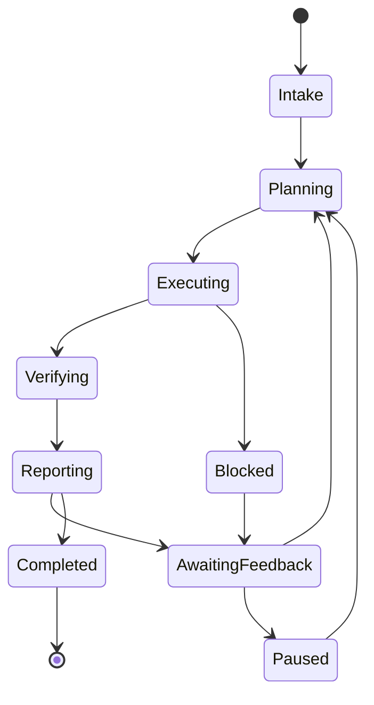

# Task Lifecycle

OpenViber supports two task origins:

- **Self-initiated** (agent discovers and proposes/picks work),
- **Manager-assigned** (explicit human request).

Both follow the same lifecycle with human checkpoints.

## 1. Lifecycle states

## 2. State intent

- **Intake**: classify origin (self-initiated or manager-assigned) and execution mode (`Always Ask`, `Agent Decides`, or `Always Execute`).
- **Planning**: update `workspace/task.md` and next actions.
- **Executing**: run tools, terminals, browser tasks, code edits.
- **Verifying**: validate outcomes from human-observable perspective.
- **Reporting**: emit report with evidence refs.
- **AwaitingFeedback**: ask manager for decisions (prefer MCQ).
- **Paused**: wait due to policy, budget, or manager instruction.
- **Blocked**: requires account access/approval/decision.

## 3. Work products by phase

- Planning -> plan diff, priorities, budget estimate.
- Executing -> terminal traces, intermediate artifacts.
- Verifying -> screenshots/logs/checklist with pass/fail.
- Reporting -> concise status + links to proof.

## 4. Periodic reporting

For long tasks or self-initiated work, vibers should report on cadence (chat/email), including:

- what changed since last report,
- current risks/blockers,
- next planned actions,
- budget burn vs limit.

## 5. Human feedback requests

When blocked by preference ambiguity, ask with options:

- recommended option first,
- clear tradeoffs per option,
- one question at a time unless tightly coupled.

## 6. Completion criteria

A task is complete only when:

1. acceptance checks pass from human perspective,
2. report includes verification clues,
3. relevant plan/progress/artifacts are persisted in workspace.
