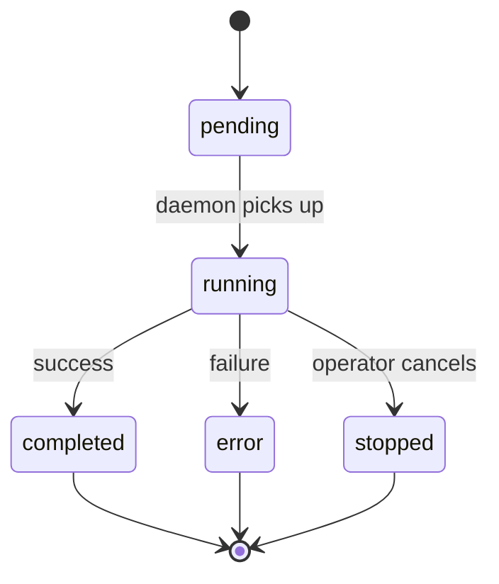

# Task Lifecycle

A task is a unit of work assigned to a viber. Tasks originate from operator messages in the Board, CLI commands, or scheduled jobs.

---

## 1. Task States



| State | Meaning |
|-------|---------|
| `pending` | Task created in the hub, waiting for the daemon to start execution |
| `running` | Daemon is executing the task (AI SDK `streamText()` in progress) |
| `completed` | Task finished successfully, result available |
| `error` | Task failed (provider error, tool error, unrecoverable issue) |
| `stopped` | Operator explicitly stopped the task via the Board |

---

## 2. Task Flow

### Submission

1. Operator sends a message in the Board (or CLI runs a command).
2. Web app calls `hubClient.submitTask(goal, viberId, messages)`.
3. Hub creates a task record (`pending`), sends `task:submit` to the daemon.

### Execution

4. Daemon receives `task:submit`, creates a `TaskRuntimeState`.
5. Daemon sends `task:started` → hub marks task as `running`.
6. Daemon calls `runTask()` → AI SDK `streamText()` with model, tools, and message history.
7. AI SDK generates response, calls tools in a loop (up to `maxSteps`).
8. Stream chunks flow: daemon → hub (WebSocket) → web app (SSE) → browser.

### Completion

9. Stream ends. Daemon sends `task:completed` with the final text and summary.
10. Hub closes SSE subscribers for that task.
11. Frontend `Chat.onFinish` callback persists the assistant's message to the database.

### Error

If the AI SDK call fails (provider error, tool error, abort):

- Daemon sends `task:error` with the error message.
- Hub marks task as `error` and closes SSE subscribers.

---

## 3. Intervention During Execution

Operators can send follow-up messages while a task is running. The daemon supports three injection modes:

| Mode | Behavior |
|------|----------|
| **collect** | Buffer the message. After the current run completes, merge all buffered messages into one follow-up turn. |
| **steer** | Immediately queue the message. Abort the current AI SDK call and restart with the new message added to history. |
| **followup** | Queue the message. After the current run completes, process it as a new turn. |

The daemon maintains a message history and processes queued follow-ups in a loop until no more remain:

```
while (queued messages remain):
    add message to history
    call runTask() again with updated history
```

---

## 4. What the AI SDK Handles Inside a Task

Within a single `runTask()` call, the AI SDK manages a multi-step agent loop:

```
streamText({ model, messages, tools, stopWhen: stepCountIs(maxSteps) })
  → Model generates text or tool call
  → If tool call: execute tool, add result to context, continue
  → If text: stream to response
  → Repeat until no more tool calls or maxSteps reached
```

`maxSteps` is configurable per agent via `AgentConfig.maxSteps` (default: 10, recommended 25 for coding tasks). Complex coding tasks that involve exploring code, planning, implementing, and verifying need more steps than simple Q&A tasks.

OpenViber doesn't need to manage the planning/executing/verifying loop — the AI SDK's multi-step tool execution handles it. The viber's system prompt instructs the model on how to approach tasks (plan first, verify results, report evidence).

### Coding Task Best Practices

The daemon runtime includes a structured coding-task system prompt that guides the model through:

1. **UNDERSTAND** — Read the task, explore the codebase, identify patterns
2. **PLAN** — Break into concrete steps, identify affected files
3. **IMPLEMENT** — Incremental changes following existing code style
4. **VERIFY** — Run tests, lint, typecheck; fix before proceeding
5. **COMMIT & REPORT** — Descriptive commits, summarize with evidence

### Personalization

The daemon loads three markdown files before every task (see [personalization.md](./personalization.md)):
- `soul.md` — How the viber communicates
- `user.md` — Who the viber serves
- `memory.md` — What the viber remembers

These are injected as `<soul>`, `<user>`, `<memory>` blocks in the system prompt before the environment context and agent prompt.

---

## 5. Stopping a Task

When the operator clicks "Stop" in the Board:

1. Web app calls `hubClient.stopTask(taskId)`.
2. Hub sends `task:stop` to the daemon.
3. Daemon sets `runtime.stopped = true` and calls `controller.abort()`.
4. The AI SDK's `AbortController` cancels the in-flight LLM call.
5. Daemon does not send `task:completed` — the task ends silently.
6. Hub marks the task as `stopped` and closes SSE subscribers.

---

## 6. Scheduled Tasks

Vibers can have cron-scheduled jobs defined in their config:

```yaml
# ~/.openviber/vibers/dev.yaml
jobs:
  - cron: "0 8 * * *"
    goal: "Check GitHub notifications and summarize"
  - cron: "0 */4 * * *"
    goal: "Monitor CI pipelines for failures"
```

Scheduled tasks follow the same lifecycle — the scheduler submits them like any other task, and they flow through the hub to the daemon.

---

## 7. Persistence

- **Task metadata**: Stored in the hub's in-memory `Map<string, Task>`. Lost on hub restart (tasks are ephemeral).
- **Message history**: Persisted to SQLite in the web app database (via `/api/vibers/[id]/messages`).
- **Session memory**: Key decisions and outcomes can be flushed to `memory.md` (see [memory.md](./memory.md)).
