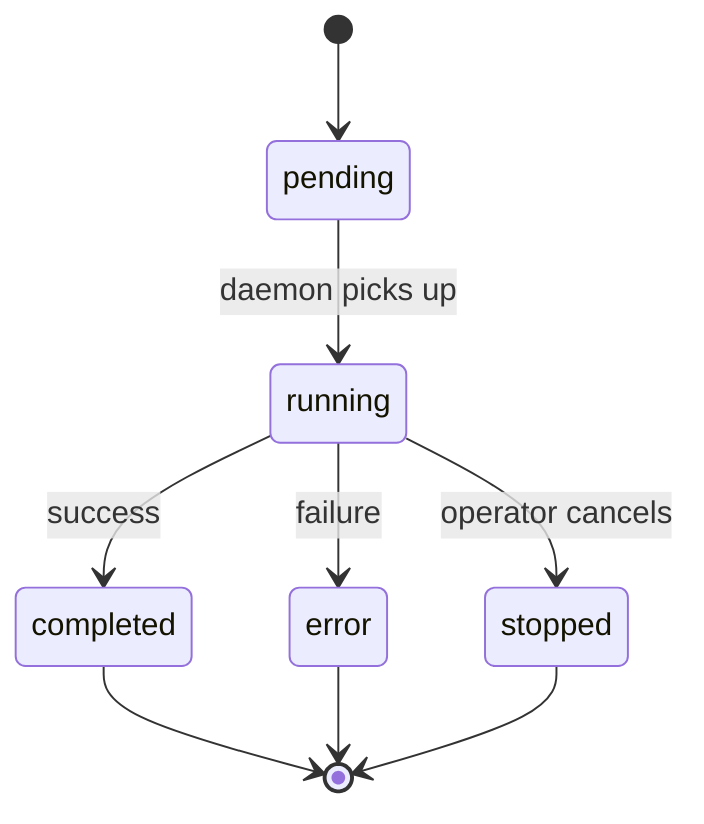

# Task Lifecycle

A task is a unit of work assigned to a viber. Tasks originate from operator messages in the Board, CLI commands, or scheduled jobs.

---

## 1. Task States



| State | Meaning |
|-------|---------|
| `pending` | Task created in the hub, waiting for the daemon to start execution |
| `running` | Daemon is executing the task (AI SDK `streamText()` in progress) |
| `completed` | Task finished successfully, result available |
| `error` | Task failed (provider error, tool error, unrecoverable issue) |
| `stopped` | Operator explicitly stopped the task via the Board |

---

## 2. Task Flow

### Submission

1. Operator sends a message in the Board (or CLI runs a command).
2. Web app calls `hubClient.submitTask(goal, viberId, messages)`.
3. Hub creates a task record (`pending`), sends `task:submit` to the daemon.

### Execution

4. Daemon receives `task:submit`, creates a `TaskRuntimeState`.
5. Daemon sends `task:started` → hub marks task as `running`.
6. Daemon calls `runTask()` → AI SDK `streamText()` with model, tools, and message history.
7. AI SDK generates response, calls tools in a loop (up to `maxSteps`).
8. Stream chunks flow: daemon → hub (WebSocket) → web app (SSE) → browser.

### Completion

9. Stream ends. Daemon sends `task:completed` with the final text and summary.
10. Hub closes SSE subscribers for that task.
11. Frontend `Chat.onFinish` callback persists the assistant's message to the database.

### Error

If the AI SDK call fails (provider error, tool error, abort):

- Daemon sends `task:error` with the error message.
- Hub marks task as `error` and closes SSE subscribers.

---

## 3. Intervention During Execution

Operators can send follow-up messages while a task is running. The daemon supports three injection modes:

| Mode | Behavior |
|------|----------|
| **collect** | Buffer the message. After the current run completes, merge all buffered messages into one follow-up turn. |
| **steer** | Immediately queue the message. Abort the current AI SDK call and restart with the new message added to history. |
| **followup** | Queue the message. After the current run completes, process it as a new turn. |

The daemon maintains a message history and processes queued follow-ups in a loop until no more remain:

```
while (queued messages remain):
    add message to history
    call runTask() again with updated history
```

---

## 4. What the AI SDK Handles Inside a Task

Within a single `runTask()` call, the AI SDK manages a multi-step agent loop:

```
streamText({ model, messages, tools, maxSteps: 10 })
  → Model generates text or tool call
  → If tool call: execute tool, add result to context, continue
  → If text: stream to response
  → Repeat until no more tool calls or maxSteps reached
```

OpenViber doesn't need to manage the planning/executing/verifying loop — the AI SDK's multi-step tool execution handles it. The viber's system prompt instructs the model on how to approach tasks (plan first, verify results, report evidence).

---

## 5. Stopping a Task

When the operator clicks "Stop" in the Board:

1. Web app calls `hubClient.stopTask(taskId)`.
2. Hub sends `task:stop` to the daemon.
3. Daemon sets `runtime.stopped = true` and calls `controller.abort()`.
4. The AI SDK's `AbortController` cancels the in-flight LLM call.
5. Daemon does not send `task:completed` — the task ends silently.
6. Hub marks the task as `stopped` and closes SSE subscribers.

---

## 6. Scheduled Tasks (Jobs)

Vibers can have cron-scheduled jobs defined as YAML files in their jobs directory:

```
~/.openviber/vibers/dev/jobs/
├── daily-summary.yaml
└── health-check.yaml
```

Each job file specifies a cron schedule, a prompt, and optional agent configuration:

```yaml
# ~/.openviber/vibers/dev/jobs/daily-summary.yaml
name: Daily Summary
schedule: "0 9 * * *"
model: deepseek/deepseek-chat
skills:
  - github
prompt: |
  Summarize my GitHub notifications from the last 24 hours.
```

### Job Execution Flow

When a job's cron trigger fires:

1. The `JobScheduler` creates a fresh `Agent` with the job's model, skills, and tools.
2. The prompt is sent as a user message via `agent.generateText()`.
3. The agent reasons, calls tools (including skill-provided tools), and generates a response.
4. Tool results and the agent's text response are logged to the console.
5. Routine "healthy" results (e.g., `antigravity_check_and_heal` returning `HEALTHY`) are suppressed from logs.

Unlike interactive tasks, scheduled jobs run independently of the hub/Board pipeline. They execute directly in the daemon process without SSE streaming. If you need a job's results in the Board, the job's prompt can use the `notify` tool to send a notification.

Jobs can also be created through chat using the `create_scheduled_job` tool (which supports natural language scheduling like "8am daily") or pushed from the Board via the `job:create` WebSocket message.

Global jobs (in `~/.openviber/jobs/`) are shared across all vibers. Per-viber jobs (in `~/.openviber/vibers/{id}/jobs/`) are scoped to a specific viber.

See [Jobs](/docs/concepts/jobs) for the full reference.

---

## 7. Persistence

- **Task metadata**: Stored in the hub's in-memory `Map<string, Task>`. Lost on hub restart (tasks are ephemeral).
- **Message history**: Persisted to SQLite in the web app database (via `/api/vibers/[id]/messages`).
- **Session memory**: Key decisions and outcomes can be flushed to `memory.md` (see [memory.md](./memory.md)).
