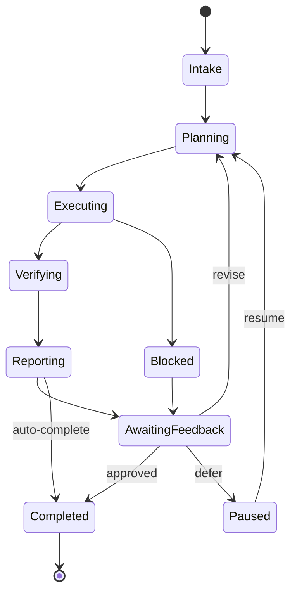

# Task Lifecycle

OpenViber supports two task origins:

- **Manager-assigned** — explicit human request via chat, Board, or channel.
- **Self-initiated** — viber discovers work through scheduled jobs, monitoring, or observation.

Both follow the same lifecycle with human checkpoints. The lifecycle integrates with the [WebSocket protocol](./protocol.md) for real-time state updates and the [communication](./communication.md) contracts for reporting.

---

## 1. Lifecycle States



---

## 2. State Definitions

| State | Intent | Entry Condition | Exit Condition |
|-------|--------|-----------------|----------------|
| **Intake** | Classify origin, determine execution mode | Task submitted or viber proposes work | Classification complete |
| **Planning** | Build or update task plan, estimate effort | After intake, feedback revision, or resume | Plan accepted or auto-approved |
| **Executing** | Run tools, write code, browse, query | Plan in place | All planned steps attempted |
| **Verifying** | Validate outcomes from human-observable evidence | Execution complete | Verification checklist evaluated |
| **Reporting** | Emit structured report with evidence refs | Verification done | Report delivered |
| **AwaitingFeedback** | Wait for human decision | Report delivered, or blocker encountered | Human responds |
| **Paused** | Suspended by policy, budget, or human instruction | Human pauses, budget limit hit | Human resumes or budget restored |
| **Blocked** | Requires external input (account access, credentials, decision) | Missing resource or permission during execution | Resource provided or decision made |
| **Completed** | Task finished, artifacts persisted | Acceptance criteria met | Terminal state |

### Intake Classification

During intake, the viber determines:

1. **Origin**: manager-assigned or self-initiated.
2. **Execution mode**: `Always Ask`, `Viber Decides`, or `Always Execute` (see [viber.md](./viber.md)).
3. **Priority**: based on explicit urgency or viber's assessment.
4. **Scope estimate**: rough token/cost budget for the task.

---

## 3. State Transitions and Protocol Messages

Each state transition maps to protocol messages (see [protocol.md](./protocol.md)):

| Transition | Protocol Message | Direction |
|------------|-----------------|-----------|
| Task submitted | `task:submit` | Client → Node |
| Intake → Planning | `task:started` | Node → Client |
| Planning → Executing | `task:progress` (status: "planning" → "executing") | Node → Client |
| Executing (streaming) | `task:delta` (if streaming enabled) | Node → Client |
| Executing → Blocked | `task:progress` (status: "blocked") | Node → Client |
| Blocked → AwaitingFeedback | Escalation message via `task:progress` | Node → Client |
| Verifying → Reporting | `task:progress` (status: "verifying") | Node → Client |
| → Completed | `task:completed` | Node → Client |
| → Error | `task:error` | Node → Client |
| Human stops task | `task:stop` / `task:stopped` | Client → Node → Client |

---

## 4. Work Products by Phase

| Phase | Outputs |
|-------|---------|
| **Planning** | Plan diff (what changed), priorities, budget estimate, risk assessment |
| **Executing** | Terminal traces, intermediate files, code changes, browser actions |
| **Verifying** | Screenshots, test output, build logs, checklist with pass/fail per item |
| **Reporting** | Concise status summary + links to evidence (artifact paths, terminal logs, URLs) |

---

## 5. Periodic Reporting

For long-running tasks or self-initiated work, vibers report on a cadence. Every periodic update follows the [communication](./communication.md) reporting envelope:

- **What changed** since the last report.
- **Current risks/blockers** requiring human attention.
- **Next planned actions** with estimated time/cost.
- **Budget burn vs. limit** — tokens used, cost accrued, remaining runway.
- **Evidence refs** — links to artifacts, terminal snapshots, screenshots.

Reporting frequency adapts to task duration:

| Task Duration | Report Cadence |
|---------------|----------------|
| < 5 minutes | Report at completion only |
| 5-30 minutes | Report at key milestones |
| 30+ minutes | Report every 10-15 minutes |
| Overnight/scheduled | Report at start, completion, and on errors |

---

## 6. Human Feedback Requests

When a viber is blocked by preference ambiguity or needs a decision, it escalates using the format defined in [communication.md](./communication.md):

- **One question at a time** (unless tightly coupled decisions).
- **Recommended option first**, clearly marked.
- **Clear tradeoffs** for each option.
- **Timeout behavior** specified — what happens if the human doesn't respond.

### Example Escalation

```
I need your input on the database schema:

→ **Option A (recommended)**: Use a single `users` table with JSON metadata column.
  Pro: Simpler queries, fewer migrations. Con: Less strict typing.

→ **Option B**: Separate `users` and `user_profiles` tables with a foreign key.
  Pro: Normalized, strict types. Con: More joins, more migrations.

→ **Option C**: Defer — skip user profiles for now, add later.
  Pro: Ship faster. Con: Schema migration needed later.

If I don't hear back in 15 minutes, I'll proceed with Option A.
```

---

## 7. Completion Criteria

A task is complete only when:

1. **Acceptance checks pass** — outcomes verified from a human-observable perspective (see [viber.md](./viber.md) verification model).
2. **Report includes verification evidence** — screenshots, logs, test results, or terminal output linked in the report.
3. **Artifacts persisted** — relevant files, plans, and progress are saved to the workspace.
4. **Memory updated** — key decisions and outcomes flushed to memory (see [memory.md](./memory.md)).

---

## 8. Error States

Task failures follow the error taxonomy in [error-handling.md](./error-handling.md). Key behaviors:

| Error Type | Task Behavior |
|------------|---------------|
| **Provider error** (rate limit, timeout) | Retry with backoff; stay in current state |
| **Tool error** (command failed, file not found) | Log error, attempt recovery or escalate |
| **Budget exhaustion** | Transition to Paused; notify human |
| **Context overflow** | Trigger compaction (see [context-management.md](./context-management.md)); retry |
| **Unrecoverable error** | Emit `task:error` with partial results; transition to Completed (failed) |
