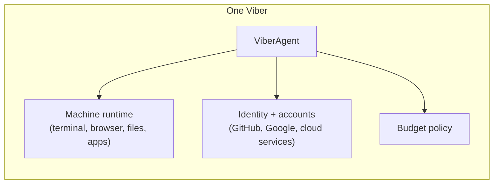
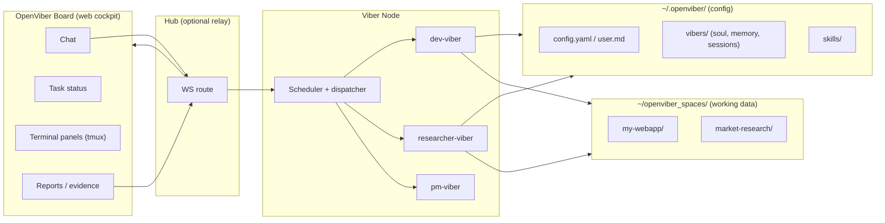
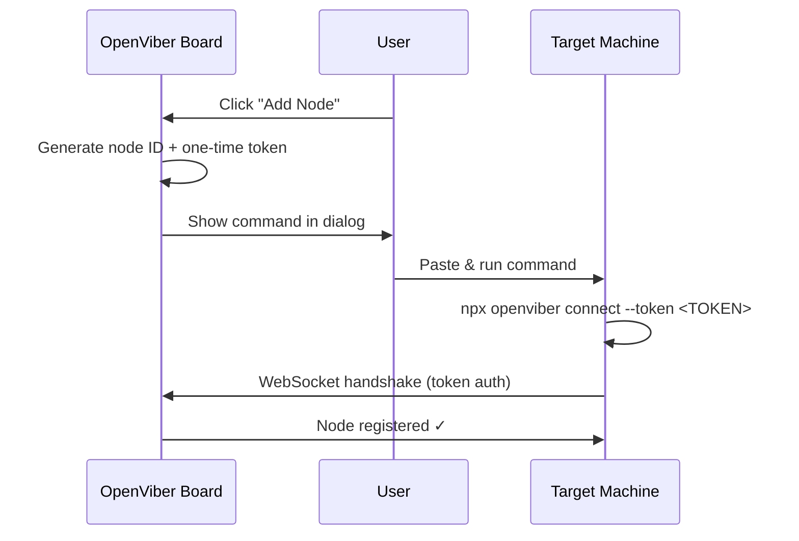

# Viber Design

OpenViber is a workspace-first platform where each **viber** is a role-scoped AI worker running on a machine you own.

---

## 1. Core Concepts

| Term | Definition |
|------|-----------|
| **Viber** | A role-scoped worker with its own persona, goals, tools, budget, and guardrails. |
| **Viber Node** | A machine running the OpenViber runtime that hosts one or more vibers. A deployment target, not a UI level. |
| **OpenViber Board** | The web cockpit operators use to observe, chat with, and control vibers. |
| **Space** | A working directory (repo, research folder, output directory) that vibers operate in. |

A viber combines three elements:



The project is **OpenViber**; each deployed worker is a **viber**.

---

## 2. System Topology



Key properties:
- **One node, many vibers.** A single Viber Node can host multiple vibers with distinct roles.
- **Process-stateless node.** The node holds no in-memory state between requests; durable context lives on disk.
- **Config ≠ working data.** `~/.openviber/` holds config and identity (small, portable). `~/openviber_spaces/` holds repos, research, and outputs (large, git-managed).

---

## 3. Storage Layout

OpenViber separates **config** from **working data** across two locations:

### Config (`~/.openviber/`) — lightweight, portable

```
~/.openviber/
├── config.yaml               # Node: daemon, providers, channels, security
├── user.md                    # Shared: who you are (same for all vibers)
├── skills/                    # Node: shared skill bundles
├── mcp/                       # Node: MCP server configs
└── vibers/
    ├── dev.yaml               # Viber config: model, tools, skills, mode, budget
    ├── dev/
    │   ├── soul.md            # Persona for this viber
    │   ├── memory.md          # Long-term memory
    │   └── sessions/          # Conversation logs (*.jsonl)
    ├── researcher.yaml
    └── researcher/
        ├── soul.md
        ├── memory.md
        └── sessions/
```

### Working Data (`~/openviber_spaces/`) — large, git-managed

```
~/openviber_spaces/
├── my-webapp/                 # Cloned repo (dev-viber works here)
├── data-pipeline/             # Another repo
├── market-research/           # Research viber workspace
└── weekly-reports/            # Reporting viber output
```

### Scoping rules

| Scope | What | Why |
|-------|------|-----|
| **Node** | `config.yaml`, `user.md`, `skills/`, `mcp/` | Shared across all vibers on this machine |
| **Viber** | `vibers/{id}.yaml`, `soul.md`, `memory.md`, `sessions/` | Each viber has its own role, memory, and history |
| **Space** | `~/openviber_spaces/*` | Multiple vibers can work on the same space |

Vibers declare which spaces they work on:

```yaml
# ~/.openviber/vibers/dev.yaml
spaces:
  - ~/openviber_spaces/my-webapp
  - ~/code/legacy-api           # can point anywhere
```

The node reads and writes config but remains process-stateless — restart freely without losing context.

---

## 4. Working Modes

OpenViber exposes familiar autonomy profiles:

| Mode | Description |
|------|-------------|
| **Always Ask** | Viber asks before each execution action. |
| **Viber Decides** | Active execution within policy-based approval boundaries. |
| **Always Execute** | High autonomy; intervene by exception. |

All modes share one loop: **observe → plan → execute → verify → report → request feedback → continue**.

---

## 5. Human Control Model

The operator always has oversight:

- **Chat** is the default intervention path — pause, resume, reprioritize, re-scope.
- **Terminal observability** via tmux streaming — watch what the viber does in real time.
- **Approval gates** for sensitive actions (file writes, deploys, sends).
- **Budget limits** prevent runaway costs.
- **Audit trail** — every action is logged to session JSONL.

---

## 6. Verification Model

Acceptance must come from human-observable evidence, not self-grading:

- Browser/app interactions
- Terminal output
- Screenshots, logs, URLs, commands
- Reports with claims linked to proof

---

## 7. Multi-Viber Coordination

When multiple vibers run on one node, they coordinate through **external systems**, not direct messaging:

```
researcher-viber → writes report → GitHub issue (state:needs-triage)
pm-viber         → triages issue → labels state:ready-for-dev
dev-viber        → implements    → opens PR (Fixes #...)
comms-viber      → announces     → GitHub release + email
```

This keeps each viber **independent and stateless** — no inter-viber protocol, no orchestration complexity. The handoff state machine lives in GitHub labels, not in OpenViber.

---

## 8. Node Onboarding

Inspired by Cloudflare Zero Trust tunnels — the Board generates a one-liner that bootstraps and connects a new node.

### Flow



### The Command

```bash
npx openviber connect --token eyJub2RlIjoiYTFiMmMz...
```

This single command:
1. Installs/updates OpenViber (via `npx`)
2. Creates `~/.openviber/` with the node config
3. Registers the node with the Board using the embedded token
4. Starts the node runtime and connects via WebSocket

### Security Properties

| Property | How |
|----------|-----|
| **One-time token** | Expires after first use or after TTL |
| **No inbound ports** | Node connects outbound to the Board |
| **Device binding** | After initial connect, device ID is pinned |
| **Revocable** | Board can revoke node access at any time |

---

## 9. Gateway Control Plane

After onboarding, the node communicates with the Board via a WebSocket control plane:

- **Single gateway per host** — one node is the authority for channel connections and viber runs on that machine.
- **WebSocket control plane** — all clients (Board, CLI, automation) connect over a typed WS protocol, declaring **role + scopes** at handshake.
- **Idempotency keys** for side-effecting requests to allow safe retries.
- **Events are push-only** — clients must refresh state on gaps; events are not replayed.
- **Remote access** — VPN/Tailscale or SSH tunnel to the gateway, reusing the same token.

---

## 10. Design Principles

1. **Config ≠ working data** — `~/.openviber/` for config, `~/openviber_spaces/` for work.
2. **Process-stateless** — the node can restart at any time without data loss.
3. **Role-scoped vibers** — each viber has a clear role, not a generic all-purpose agent.
4. **External coordination** — vibers coordinate through tools (GitHub, email), not inter-viber messaging.
5. **Human oversight** — operators can always observe, intervene, and approve.
6. **Evidence-based verification** — no unverifiable self-grading.
7. **Token-based onboarding** — zero inbound ports, one command to connect.
