import { Aside, LinkCard, CardGrid } from '@astrojs/starlight/components';

## Overview

**Viber** is an open-source Cowork Desktop that runs a team of AI agents on your local machine. It provides infrastructure for AI agents to collaborate on complex tasks with full access to local computer resources.

<Aside type="tip">
  Think of Viber as your "AI workforce" — specialized agents working together, running locally, connecting outward to your enterprise channels.
</Aside>

## Three-Pillar Architecture

Viber is built on three core pillars:


| Pillar | Purpose | Location |
|--------|---------|----------|
| **Jobs** | Scheduled automation (YAML cron) | `examples/jobs/` |
| **Skills** | Agent capabilities (SKILL.md) | `skills/` |
| **Tools** | Browser, file, desktop control | `src/tools/` |

## Core Components

### ViberAgent (Team Leader)

The orchestrating agent that manages plans, delegates to specialized agents, and coordinates tool execution:

```mermaid
flowchart LR
    User["User Request"] --> ViberAgent
    ViberAgent --> Planning["📋 Plan Creation"]
    Planning --> Delegation["👥 Agent Delegation"]
    Delegation --> Tools["🔧 Tool Execution"]
    Tools --> Result["✅ Result"]
    Result --> User
```



- **Plan Creation**: Breaks complex goals into executable steps
- **Agent Orchestration**: Delegates tasks to specialized workers
- **Tool Coordination**: Invokes tools and handles results
- **Context Management**: Maintains conversation and task history

### Worker Agents

Specialized agents designed for specific tasks:

- **Stateless Design**: No memory between invocations
- **Role Definition**: Clear purpose via system prompt
- **Tool Access**: Scoped set of available tools
- **LLM Connection**: Interface to language models

### Space (Workspace)

An isolated workspace that encapsulates:

- **Artifacts**: Generated files and outputs
- **History**: Conversation and task logs
- **Configuration**: Space-specific settings

## System Architecture

```mermaid
flowchart TB
    subgraph Channels["📱 Enterprise Channels"]
        DingTalk["钉钉<br/>DingTalk"]
        WeCom["企业微信<br/>WeCom"]
        WebUI["🌐 Web"]
    end
    
    subgraph Viber["🖥️ Viber Cowork Desktop"]
        subgraph AgentLayer["Agent Layer"]
            ViberAgent["ViberAgent<br/>(Leader)"]
            Workers["Worker Agents"]
        end
        
        subgraph ToolLayer["Tool Layer"]
            Browser["🌐 Browser"]
            FileSystem["📁 Files"]
            MCP["🔌 MCP"]
            Desktop["🖱️ Desktop"]
        end
        
        subgraph CoreServices["Core Services"]
            Scheduler["⏰ Job Scheduler"]
            SkillRegistry["📚 Skill Registry"]
        end
    end
    
    subgraph Storage["💾 Storage"]
        Local["Local FS"]
        Supabase["Supabase"]
    end
    
    subgraph LLM["🤖 LLM Providers"]
        OpenAI["OpenAI"]
        Anthropic["Anthropic"]
        OpenRouter["OpenRouter"]
    end
    
    Channels <-->|Outbound| ViberAgent
    ViberAgent --> Workers
    Workers --> ToolLayer
    ViberAgent --> CoreServices
    ToolLayer --> Storage
    Workers <--> LLM
```



## Key Design Principles

### 1. Outbound-Only Connection

Viber connects **outward** to channels — no public IP or inbound ports required:


### 2. Human-in-the-Loop

Critical for long-running vibe-working tasks:

```mermaid
flowchart TB
    Agent["Agent Working"] --> Decision{"Critical Action?"}
    Decision -->|No| Continue["Continue Autonomously"]
    Decision -->|Yes| Pause["⏸️ Pause for Approval"]
    Pause --> Human["👤 Human Review"]
    Human -->|Approve| Continue
    Human -->|Reject| Revise["Revise Approach"]
    Revise --> Agent
```



- **Approval Gates**: Pause before critical actions
- **Interactive Channels**: Real-time collaboration
- **Progressive Autonomy**: Start supervised, increase freedom
- **Context Handoff**: Seamless human-agent transfer

### 3. Privacy First

- 100% local execution
- Data never leaves your machine
- Your API keys, your control

### 4. Type-First Design

- Full TypeScript support
- Zod schemas for validation
- AI SDK integration

## Data Flow


## Job Scheduling

Jobs are defined in YAML and run on a cron schedule:

```yaml
# examples/jobs/morning-standup.yaml
name: morning-standup
schedule: "0 9 * * 1-5"  # 9 AM, Mon-Fri
prompt: "Check GitHub notifications and Slack, summarize what needs attention"
model: anthropic/claude-sonnet-4-20250514
```



```mermaid
flowchart LR
    YAML["📄 YAML Job"] --> Scheduler["⏰ Scheduler"]
    Scheduler -->|Cron trigger| ViberAgent
    ViberAgent --> Execute["Execute prompt"]
    Execute --> Channel["Report to channel"]
```

## Skill System

Skills are defined in `SKILL.md` files:

```markdown
---
name: git-commit
description: Stage and commit changes
parameters:
  message:
    type: string
    required: true
---
git add . && git commit -m "$message"
```


## MCP Integration

Connect to any Model Context Protocol server:

```yaml
mcp_servers:
  - name: github
    command: npx -y @modelcontextprotocol/server-github
  - name: filesystem
    command: npx -y @modelcontextprotocol/server-filesystem
```


## Related Documentation

<CardGrid>
  <LinkCard title="Desktop Tools" href="/design/desktop-tools" description="GUI automation with browser control" />
  <LinkCard title="Tool Execution" href="/design/tool-execution" description="Tool system design" />
  <LinkCard title="Task Lifecycle" href="/design/task-lifecycle" description="How tasks are executed" />
  <LinkCard title="Philosophy" href="/design/philosophy" description="Design principles and vision" />
</CardGrid>
